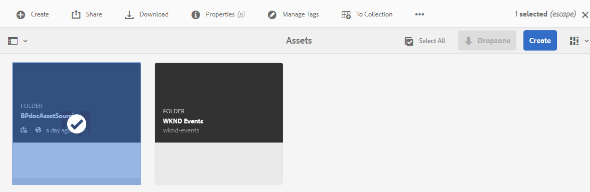

# Konfigurera bidragsmappen i Experience Manager Assets {#configure-contribution-folder}

För samverkansbaserad resurskälla kan Experience Manager Assets-användare (administratörer och icke-adminanvändare med behörighet) skapa mappar av typen **Resursbidrag**, och se till att den skapade mappen är öppen för att skickas av Brand Portal-användare.  Den här metoden utlöser automatiskt ett arbetsflöde som skapar ytterligare två undermappar, som kallas **DELAD** och **NY**, i den nya **Contribute** -mappen.

Experience Manager Assets-användaren definierar tillgångskraven genom att ladda upp en översikt över de typer av resurser som ska läggas till i mappen för bidrag. De överför också en uppsättning basresurser till SHARED-mappen för att säkerställa att Brand Portal-användare har den information de behöver. Administratören kan sedan ge aktiva Brand Portal-användare åtkomst till bidragsmappen innan den nya Contribute-mappen publiceras på Brand Portal.

I följande video visas hur du konfigurerar en Contribute-mapp i Experience Manager Assets:

>[!VIDEO](https://video.tv.adobe.com/v/30547)

Experience Manager Assets-användare utför följande åtgärder när de konfigurerar en mapp för bidrag:

* [Skapa en avgiftsmapp](#create-contribution-folder)
* [Överför tillgångskrav och tilldela medverkande](#configure-contribution-folder-properties)
* [Överför baslinjeresurser](#uplad-new-assets-to-contribution-folder)
* [Publish avgiftsmapp från Experience Manager Assets till Brand Portal](#publish-contribution-folder-to-brand-portal)

## Skapa avgiftsmapp {#create-contribution-folder}

Experience Manager Assets-administratörer och icke-adminanvändare med behörighet att skapa en ny mapp kan skapa en mapp för bidrag i Experience Manager Assets.
Om du vill skapa en bidragsmapp skapar du en mapp med resursavgift som säkerställer att den skapade mappen är öppen för att skickas in av Brand Portal-användare. Den här metoden aktiverar automatiskt ett arbetsflöde som skapar ytterligare två undermappar, som kallas SHARED och NEW, i bidragsmappen.

>[!NOTE]
>
>Administratörerna kan skapa flera resursavgiftsmappar i en mapp.
>
>En mapp för tillgångsavgifter innehåller mapparna NEW och SHARED för resursernas distribution och bidrag. Skapa inte en resursmapp eller en bidragsmapp i en bidragsmapp.

Du kan konfigurera bidragsmappens egenskaper separat och samtidigt som du skapar bidragsmappen. I det här exemplet konfigureras egenskaperna separat.

**Så här skapar du en bidragsmapp:**

1. Logga in på din Experience Manager Assets-instans.

1. Navigera till **[!UICONTROL Assets]** > **[!UICONTROL Files]**. Den visar alla befintliga mappar i Experience Manager Assets-databasen.

1. Klicka på **[!UICONTROL Create]** om du vill skapa en ny mapp. Dialogrutan **[!UICONTROL Create Folder]** öppnas.

1. Ange **[!UICONTROL Title]** och **[!UICONTROL Name]** för mappen och markera kryssrutan **[!UICONTROL Asset Contribution]**.
Adobe rekommenderar att du använder gemener utan mellanslag för att ge mappen ett namn.

1. Klicka på **[!UICONTROL Create]**. Du kan se bidragsmappen i Experience Manager Assets-databasen.

   >[!NOTE]
   >
   >En icke-admin-användare kan skapa och dela en resursavgiftsmapp, men kan inte ändra eller ta bort den.

   

1. Öppna mappen för bidrag. Du kan se två undermappar - **[!UICONTROL SHARED]** och **[!UICONTROL NEW]** - som skapas automatiskt i avgiftsmappen.

   

## Konfigurera egenskaper för bidragsmapp {#configure-contribution-folder-properties}

Experience Manager Assets-administratören utför följande åtgärder när egenskaperna för en avgiftsmapp konfigureras.

* **Lägg till beskrivning**: Ange en beskrivning på hög nivå av mappen för bidrag.
* **Överför i korthet**: Överför ett tillgångskravsdokument som innehåller resursrelaterad information.
* **Lägg till medverkande**: Lägg till Brand Portal-användare för att ge dem åtkomst till mappen för bidrag.

Resurskravet avser den information som administratörer tillhandahåller för att hjälpa medverkande (Brand Portal-användare) att förstå behovet och kraven av avgiftsmappen. Administratören överför ett tillgångskravsdokument med information om resurstyperna för bidragsmappen, inklusive syfte, bildtyper och maximal storlek.

**Så här konfigurerar du bidragsmappens egenskaper:**

1. Logga in på din Experience Manager Assets-instans.

1. Navigera till **[!UICONTROL Assets > Files]** och leta upp mappen för bidrag.
1. Välj mapp för bidrag och klicka på **[!UICONTROL Properties]** för att öppna fönstret Mappegenskaper.

   

   

1. Navigera till fliken **[!UICONTROL Asset Contribution]**.
1. Ange en hög nivå **[!UICONTROL Description]** i mappen för bidrag.
1. Klicka på **[!UICONTROL Upload Brief]** om du vill bläddra från den lokala datorn och överföra ett **resurskravsdokument**.

   

1. I fältet **[!UICONTROL Add User]** lägger du till Brand Portal-användare som du vill dela bidragsmappen med. De här användarna kan komma åt och överföra innehåll till bidragsmappen via Brand Portal-gränssnittet.
1. Klicka på **[!UICONTROL Save]**.

   

>[!NOTE]
>
>Sökresultaten baseras på Brand Portal användarlista som konfigurerats i Experience Manager Assets. Se till att du har den uppdaterade användarlistan för Brand Portal.

Administratörerna kan hämta filen `user.csv` från [!DNL Admin Console] och använda den som basmall för att lägga till Brand Portal-användare. Gå till [!UICONTROL Users] och klicka på alternativet [!UICONTROL Export users list to csv] för att hämta filen `users.csv`. Följande exempelanvändare visar vilka attribut som krävs för att lägga till användarna. Det enda obligatoriska attributet för en användarpost är `Email` och alla andra attribut är valfria.

[Hämta fil](assets/users.csv)

## Överför resurser till mappen för bidrag {#uplad-new-assets-to-contribution-folder}

Experience Manager Assets-användare överför en uppsättning baslinjeresurser till mappen **SHARED** för att se till att användare av Brand Portal har den information de behöver.

**Så här överför du baslinjeresurser:**

1. Logga in på din Experience Manager Assets-instans.

1. Navigera till **[!UICONTROL Assets > Files]** och leta upp mappen för bidrag.

1. Markera mappen för bidrag och klicka för att öppna den.

1. Klicka på mappen **[!UICONTROL NEW]**.

   

1. Klicka på **[!UICONTROL Create]** > **[!UICONTROL Files]** om du vill överföra enskilda filer eller mappar (.zip) som innehåller flera resurser.

   

1. Bläddra och överför resurser (filer eller mappar) till mappen **[!UICONTROL NEW]**.

   

När du har överfört alla resurser eller mappar till mappen NEW publicerar du mappen för bidrag till Experience Manager Assets.

## Publish-mapp för bidrag till Brand Portal {#publish-contribution-folder-to-brand-portal}

När bidragsmappen har konfigurerats kan Experience Manager Assets-användare (administratör/icke-admin-användare) publicera bidragsmappen från Experience Manager Assets till Brand Portal. Brand Portal-användare som har behörighet att komma åt bidragsmappen, får ett e-postmeddelande eller ett pulsmeddelande när publiceringsåtgärden har slutförts.

**Så här publicerar du en bidragsmapp:**

1. Logga in på din Experience Manager Assets-instans.

1. Navigera till **[!UICONTROL Assets > Files]** och leta upp den mapp där du vill publicera till Brand Portal.
1. Välj en avgiftsmapp och klicka på **[!UICONTROL Quick Publish]** > **[!UICONTROL Publish to Brand Portal]**.

   

   Du får ett meddelande när bidragsmappen har publicerats till Brand Portal.

Ett e-post-/pulsmeddelande skickas till de Brand Portal-användare som är tilldelade bidragsmappen. Brand Portal-användare har tillgång till bidragsmappen och kan påbörja ett bidrag. Se [Överför resurser till mappen för bidrag och publicera till Experience Manager Assets](brand-portal-publish-contribution-folder-to-aem-assets.md).
