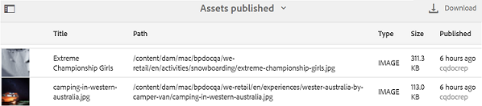

# Arbeta med rapporter {#work-with-reports}

Rapporteringsfunktionen är avgörande vid bedömning av Brand Portal användning och för att veta hur interna och externa användare interagerar med godkända resurser. Administratörer kan visa Brand Portal-användningsrapporten, som alltid är tillgänglig på sidan Resursrapporter. Rapporter om användarinloggningar och resurser som hämtats, gått ut, publicerats och delats via länkar kan dock genereras och visas på sidan Resursrapporter. Dessa rapporter är till hjälp när det gäller att analysera resursdistributionen, vilket gör att ni kan ta fram viktiga framgångsmått för att mäta användningen av godkända resurser inom och utanför organisationen.

Rapporthanteringsgränssnittet är intuitivt och innehåller detaljerade alternativ och kontroller för att komma åt sparade rapporter. Du kan visa, hämta eller ta bort rapporter från sidan Resursrapporter, där alla tidigare genererade rapporter listas.

## Visa rapporter {#view-reports}

Så här visar du en rapport:

1. Klicka på Experience Manager-logotypen i verktygsfältet överst för att öppna administrationsverktygen.

   

1. Öppna sidan **[!UICONTROL Asset Reports]** genom att klicka på **[!UICONTROL Create/Manage Reports]** på panelen Administrationsverktyg.

   

1. Åtkomst till rapporten **[!UICONTROL Usage]** och andra genererade rapporter från sidan Resursrapporter.

   >[!NOTE]
   >
   >Användningsrapport är en standardrapport som genereras i Brand Portal. Den kan inte skapas eller tas bort. Du kan dock skapa, hämta och ta bort rapporterna Hämta, Förfallotid, Publish, `Link Share` och användarinloggningar.

   Om du vill visa en rapport klickar du på rapportlänken. Du kan också markera rapporten och klicka på ikonen Visa i verktygsfältet.

   **[!UICONTROL Usage Report]** visar information om antalet aktiva Brand Portal-användare, det lagringsutrymme som används av alla resurser och det totala antalet resurser i Brand Portal. Brand Portal-användare som inte har tilldelats någon produktprofil i Admin Console betraktas som inaktiva användare och återspeglas inte i **[!UICONTROL Usage Report]**.
Rapporten visar även tillåten kapacitet för var och en av dessa informationsmått.

   

   Rapporten **[!UICONTROL User Logins]** innehåller information om de användare som loggade in på Brand Portal. Rapporten innehåller visningsnamn, e-post-ID:n, profiler (admin, visningsprogram, redigerare, gäst), grupper, senaste inloggning, aktivitetsstatus och inloggningsstatus för varje användare från Brand Portal 6.4.2-distributionen fram till tidpunkten för rapportgenereringen.

   

   **[!UICONTROL Download]**-rapporten innehåller listor och information om alla resurser som hämtats inom ett visst datum- och tidsintervall.

   

   >[!NOTE]
   >
   >Resurserna **[!UICONTROL Download]** i rapporten visar bara de resurser som har valts separat och hämtats från Brand Portal. Om en användare har hämtat en mapp som innehåller resurser visas inte mappen eller resurserna i mappen i rapporten.

   Rapporten **[!UICONTROL Expiration]** innehåller en lista med och information om alla resurser som har gått ut inom en viss tidsram.

   

   **[!UICONTROL Publish]**-rapporten innehåller en lista med och information om alla resurser som publiceras från Experience Manager Assets till Brand Portal inom en angiven tidsram.

   

   >[!NOTE]
   >
   >Publish Report visar inte information om innehållsfragment eftersom innehållsfragmenten inte kan publiceras till Brand Portal.

   Rapporten **[!UICONTROL Link Share]** visar alla resurser som delas via länkar från Brand Portal-gränssnittet under en viss tidsperiod. Rapporten innehåller information om när resursen delades via en länk, som användaren delade den med, och länkens förfallodatum. Här rapporteras även antalet delade länkar för klientorganisationen och användare. Det går inte att anpassa kolumnerna i länkdelningsrapporten.

   

   >[!NOTE]
   >
   >I länkdelningsrapporten visas inte användare som har åtkomst till resursen som delas via länken eller som har hämtat resursen via länken.
   >
   >Om du vill spåra hämtningar via den delade länken måste du generera en hämtningsrapport efter att du har valt alternativet **[!UICONTROL Only Link Share Downloads]** på sidan **[!UICONTROL Create Report]**. Användaren (hämtas av) är dock anonym i det här fallet.

## Generera rapporter {#generate-reports}

Administratörer kan generera och hantera följande standardrapporter. Efter genereringen sparas rapporterna för [senare åtkomst](../using/brand-portal-reports.md#main-pars-header).

* Användarinloggningar
* Ladda ned
* Förfallotid
* Publish
* Länkdelning

Kolumnerna i Download-, Expiration- och Publish-rapporten kan anpassas för visning. Så här skapar du en rapport:

1. Klicka på Experience Manager-logotypen i verktygsfältet överst för att öppna administrationsverktygen.

1. Öppna sidan **[!UICONTROL Asset Reports]** genom att klicka på **[!UICONTROL Create/Manage Reports]** på panelen Administrationsverktyg.

   

1. Klicka på **[!UICONTROL Create]** på sidan Resursrapporter.
1. På sidan **[!UICONTROL Create Report]** väljer du en rapport att skapa och klickar sedan på **[!UICONTROL Next]**.

   

1. Konfigurera rapportinformation. Ange rubrik, beskrivning, mappstruktur (där rapporten måste köras och generera statistik) och datumintervall för **[!UICONTROL Download]**-, **[!UICONTROL Expiration]**- och **[!UICONTROL Publish]**-rapporter.

   

   Rapporten **[!UICONTROL Link Share]** behöver bara parametrarna för titel, beskrivning och datumintervall.

   

   >[!NOTE]
   >
   >När du skapar rapporten ersätts specialtecknen `#` och `%` i titeln med ett bindestreck (-).

1. Klicka på **[!UICONTROL Next]** om du vill konfigurera kolumnerna för Hämta, Förfallotid och Publish-rapporter.
1. Markera eller avmarkera kryssrutorna efter behov. Om du till exempel vill visa namn på användare (som hämtade resurser) i rapporten **[!UICONTROL Download]** väljer du **[!UICONTROL Downloaded By]**. Följande bild visar hur du väljer standardkolumner i hämtningsrapporten.

   

   Du kan också lägga till anpassade kolumner i de här rapporterna för att visa mer data för dina anpassade behov.

   Så här lägger du till anpassade kolumner i hämtnings-, Publish- eller förfallorapporten:

   1. Om du vill visa en anpassad kolumn klickar du på **[!UICONTROL Add]** i [!UICONTROL Custom Columns].
   1. Ange namnet på kolumnen i fältet **[!UICONTROL Column Name]**.
   1. Välj den egenskap som kolumnen ska mappas till med hjälp av en egenskapsväljare.

      
Du kan också skriva sökvägen i fältet för egenskapssökväg.

      

      Om du vill lägga till fler anpassade kolumner klickar du på **Lägg till** och upprepar steg 2 och 3.

1. Klicka på **[!UICONTROL Create]**. Ett meddelande meddelar att rapportgenereringen har initierats.

## Ladda ned rapporter {#download-reports}

Om du vill spara och hämta en rapport som en CSV-fil gör du något av följande:

* Välj en rapport på sidan Resursrapporter och klicka på **[!UICONTROL Download]** i verktygsfältet högst upp.

* Öppna en rapport på sidan Resursrapporter. Välj alternativet **[!UICONTROL Download]** högst upp på rapportsidan.

## Ta bort rapporter {#delete-reports}

Om du vill ta bort en befintlig rapport markerar du rapporten på sidan **[!UICONTROL Asset Reports]** och klickar på **[!UICONTROL Delete]** i verktygsfältet högst upp.

>[!NOTE]
>
>Det går inte att ta bort rapporten **[!UICONTROL Usage]**.
