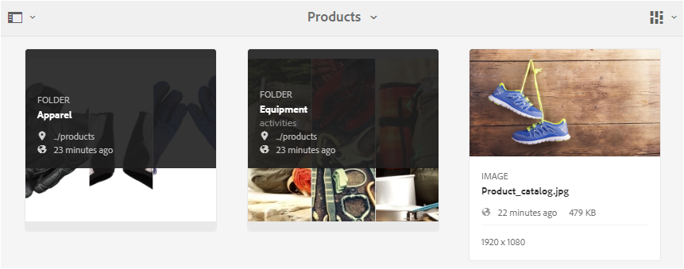

# Dela mappar i Brand Portal {#share-folders}

Assets måste publiceras till Brand Portal från en förkonfigurerad Experience Manager Author-instans eftersom Brand Portal inte stöder tillgångsintag.

## Arbetsflöde för mappdelning i Brand Portal {#folder-sharing-workflow-in-brand-portal}

Nedan beskrivs arbetsflödet för mappdelning och användaråtkomst:

* Som standard visas alla mappar som publiceras från Experience Manager Assets till Brand Portal endast för Brand Portal Administrator, såvida de inte är markerade som public när replikeringen konfigureras.
* Administratören använder konsolen **[!UICONTROL Folder Properties]** för att dela en mapp med selektiva användare eller grupper. Endast de användare eller grupper som mappen delas med kan se mappen när de har loggat in på Brand Portal. Mappen visas inte för andra användare.
* Administratören kan även välja att göra en mapp offentlig genom kryssrutan **[!UICONTROL Public Folder]** i konsolen **[!UICONTROL Folder Properties]**. En gemensam mapp visas för alla användare.

* Oberoende av användarroller och behörigheter kan användare som loggar in på Brand Portal se alla gemensamma mappar och de mappar som delas direkt med dem eller med en grupp som de tillhör. Privata mappar, eller mappar som delas med andra användare, visas inte för alla användare.

### Dela mappar med användargrupper på Brand Portal {#sharing-folders-with-user-groups-on-brand-portal}

Åtkomsträttigheter för resurser i en mapp är beroende av åtkomsträttigheterna för den överordnade mappen, oavsett inställningarna för de underordnade mapparna. [ACL:er](https://experienceleague.adobe.com/en/docs/experience-manager-65/content/security/security) i AEM styr det här beteendet, där underordnade mappar ärver ACL:er från sina överordnade mappar. Anta till exempel att mappen A innehåller mappen B, som innehåller mappen C. En användargrupp (eller användare) med åtkomsträttigheter för mappen A har samma åtkomsträttigheter för mappen B och C. Mapp B är undermappen till A ärver sina åtkomstkontrollistor och mapp C är undermappen till B ärver åtkomstkontrollistor.

På samma sätt har användargrupper (eller användare) som endast har åtkomst till mappen B samma åtkomstbehörighet till mappen C men inte till mappen A. Adobe rekommenderar att du ordnar innehåll så att de mest exponerade resurserna placeras i underordnade mappar, vilket tillåter åtkomst från de underordnade mapparna upp till rotmappen.

### Publicering av offentlig mapp {#public-folder-publish}

Icke-adminanvändare (som redigerare och visningsprogram) kan bara komma åt resurser som publicerats från AEM Assets till Brand Portal om alternativet **[!UICONTROL Public Folder Publish]** väljs under Brand Portal-replikeringskonfigurationen.

Om alternativet **[!UICONTROL Public Folder Publish]** är inaktiverat måste administratörer dela dessa resurser specifikt med icke-adminanvändare som använder delningsfunktionen.

>[!NOTE]
>
>Alternativet för att aktivera **[!UICONTROL Public Folder Publish]** finns i AEM 6.3.2.1 och senare.

## Åtkomst till delade mappar {#access-to-shared-folders}

I följande matris beskrivs åtkomsträttigheter och rättigheter att dela eller ta bort delning av resurser för olika användarroller:

|               | Åtkomst till alla mappar som publicerats från AEM Assets till Brand Portal | Åtkomst till delade mappar | Dela eller ta bort mapprättigheter |
|---------------|-----------|-----------|------------|
| Administratör | Ja | Ja | Ja |
| Redigerare | Nej* | Ja, endast om det delas med dem eller med den grupp de tillhör | Ja, endast för de mappar som delas med dem eller med den grupp som de tillhör |
| Visningsprogram | Nej* | Ja, endast om det delas med dem eller med den grupp de tillhör | Nej |
| Gästanvändare | Nej* | Ja, endast om det delas med dem eller med den grupp de tillhör | Nej |

>[!NOTE]
>
>Som standard är alternativet **[!UICONTROL Public Folder Publish]** inaktiverat när replikering av Brand Portal konfigureras med AEM författare. Om alternativet är aktiverat är de mappar som publiceras till Brand Portal tillgängliga för alla användare (även icke-adminanvändare) som standard.

### Åtkomst till delade mappar som inte är administratörsanvändare {#non-admin-user-access-to-shared-folders}

Användare som inte är administratörer har bara åtkomst till de mappar som delas med dem på Brand Portal. Hur de här mapparna visas på portalen när de loggar in beror dock på inställningarna för **[!UICONTROL Enable Folder Hierarchy]**-konfigurationen.

**Om konfigurationen är inaktiverad**

Användare som inte är administratörer kan se alla mappar som delas med dem på landningssidan när de loggar in på Brand Portal.

**Om konfigurationen är aktiverad**

Användare som inte är administratörer kan se mappträdet (från rotmappen) och de delade mapparna i sina respektive överordnade mappar när de loggar in på Brand Portal.

De här överordnade mapparna är virtuella mappar och inga åtgärder kan utföras på dem. Du känner igen dessa virtuella mappar med en låsikon.

Inga åtgärder visas när du hovrar eller markerar dem i **[!UICONTROL Card View]**, till skillnad från delade mappar. Knappen **[!UICONTROL Overview]** visas när du väljer en virtuell mapp i **[!UICONTROL Column View]** och **[!UICONTROL List View]**.

>[!NOTE]
>
>Observera att standardminiatyrbilden för de virtuella mapparna är miniatyrbilden för den första delade mappen.

   

## Dela mappar {#how-to-share-folders}

Så här delar du en mapp med användare på Brand Portal:

1. Klicka på övertäckningsikonen till vänster och välj **[!UICONTROL Navigation]**.

   

1. Välj **[!UICONTROL Files]** från sidospåret till vänster.

   

1. I Brand Portal-gränssnittet väljer du den mapp du vill dela.

   

1. Välj **[!UICONTROL Share]** i verktygsfältet högst upp.

   

   Konsolen [!UICONTROL Folder Properties] visas.

   

1. I konsolen **[!UICONTROL Folder Properties]** anger du mapptiteln i fältet **[!UICONTROL Folder Title]** om du inte vill att standardnamnet ska visas för användarna.
1. I listan **[!UICONTROL Add User]** markerar du de användare eller grupper som du vill dela mappen med och klickar på **[!UICONTROL Add]**.
Om du bara vill dela mappen med gästanvändare och inga andra användare väljer du **[!UICONTROL Anonymous Users]** i listrutan **[!UICONTROL Members]**.

   

   >[!NOTE]
   >
   >Om du vill göra mappen tillgänglig för alla användare oavsett deras gruppmedlemskap och roll markerar du kryssrutan **[!UICONTROL Public Folder]**.

1. Om det behövs klickar du på **[!UICONTROL Change Thumbnail]** för att ändra miniatyrbilden för mappen.
1. Klicka på **[!UICONTROL Save]**.

1. Om du vill komma åt den delade mappen loggar du in på Brand Portal med inloggningsuppgifterna för den användare som du delade mappen med. Granska den delade mappen i gränssnittet.

## Dela inte mappar {#unshare-the-folders}

Så här tar du bort delningen av en tidigare delad mapp:

1. I Brand Portal-gränssnittet väljer du den mapp du vill ta bort delningen av.

   

1. Klicka på **[!UICONTROL Share]** i verktygsfältet överst.
1. Klicka på symbolen **[!UICONTROL x]** bredvid en användare i **[!UICONTROL Folder Properties]**-konsolen under **[!UICONTROL Members]** för att ta bort dem från listan över användare som du delade mappen med.

   

1. Klicka på **[!UICONTROL Confirm]** i varningsmeddelanderutan för att bekräfta att du inte vill dela.
Klicka på **[!UICONTROL Save]**.

1. Logga in på Brand Portal med inloggningsuppgifterna för den användare du tog bort från den delade listan. Mappen är inte längre tillgänglig i Brand Portal-gränssnittet för användaren.
