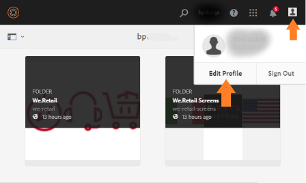

# Översikt över Experience Manager Assets Brand Portal {#overview-of-aem-assets-brand-portal}

Som marknadsförare behöver ni ibland samarbeta med kanalpartners och interna affärsanvändare för att skapa, hantera och snabbt leverera relevant digitalt innehåll till kunder. Snabb leverans av relevant innehåll under hela kundresan är avgörande för att öka efterfrågan, konvertering, engagemang och kundlojalitet.

Men det är en utmaning att utveckla lösningar som stöder effektiv och säker delning av sådant som godkända varumärkeslogotyper, kampanjresurser eller produktbilder med team, partners och återförsäljare. För att säkerställa både effektivitet och säkerhet i den här processen krävs noggrann planering och genomförande.

**Adobe Experience Manager (AEM) Assets Brand Portal** fokuserar på marknadsförarens behov av att samarbeta effektivt med globalt distribuerade Brand Portal-användare genom att tillhandahålla funktioner för resursdistribution och resursbidrag.

Med mediedistribution kan ni skaffa, styra och säkert distribuera godkända kreativa resurser till externa parter och interna företagsanvändare på olika enheter. Med Assets-komponenten kan Brand Portal-användare dock överföra mediefiler till Brand Portal och publicera till Experience Manager Assets utan att behöva ha tillgång till redigeringsmiljön. Avgiftsfunktionen anropas som **Assets-källa i Brand Portal**. Dessutom förbättrar det den övergripande Brand Portal-upplevelsen av resursdistribution och bidrag från Brand Portal-användare (externa byråer/team), snabbar upp time-to-market för mediefiler och minskar risken för bristande efterlevnad och obehörig åtkomst.
Se [Resurser i Brand Portal](brand-portal-asset-sourcing.md).

I den webbläsarbaserade portalmiljön kan du enkelt överföra, bläddra bland, söka efter, förhandsgranska och exportera resurser i godkända format.

## Konfigurera Experience Manager Assets med Brand Portal {#configure-brand-portal}

Om du konfigurerar Adobe Experience Manager Assets med Brand Portal kan Brand Portal-användare publicera mediefiler, distribuera resurser och bidra med resurser.

>[!NOTE]
>
>Konfigurering av Experience Manager Assets med Brand Portal stöds i Experience Manager Assets as a Cloud Service, Experience Manager Assets 6.3 och senare.

>[!IMPORTANT]
>
> * Brand Portal är för närvarande under underhåll.
> * Du kan kontakta Adobe och få information om ditt användningssätt och specifika krav för att aktivera Brand Portal med Cloud Manager.
> * Brand Portal ingår inte i Assets Prime eller Assets Ultimate. Befintliga Assets Cloud Services-kunder som redan har tillgång till Brand Portal kan dock behålla det när de går över till Assets Ultimate.

<!--Experience Manager Assets as a Cloud Service is automatically configured with Brand Portal by activating Brand Portal from the Cloud Manager. The activation workflow creates the required configurations at the backend and activates Brand Portal on the same IMS org as of the Experience Manager Assets as a Cloud Service instance.-->

Men Experience Manager Assets (lokal och hanterad tjänst) konfigureras manuellt med Brand Portal med Adobe Developer Console, som anskaffar en Adobe Identity Management Services-token (IMS) för auktorisering av Brand Portal-klienten.

Mer information finns i [Konfigurera Experience Manager Assets med Brand Portal](../using/configure-aem-assets-with-brand-portal.md).

## Användarprofiler i Brand Portal {#Personas}

Brand Portal har stöd för följande användarroller:

* Gästanvändare
* Visningsprogram
* Redigerare
* Administratör

I följande tabell visas de uppgifter som användare i dessa roller kan utföra:

|  | **Bläddra** | **Sökning** | **Hämta** | **Dela mappar** | **Dela en samling** | **Dela resurser som en länk** | **Åtkomst till administratörsverktyg** |
|--- |--- |--- |--- |--- |--- |--- |--- |
| **Gästanvändare** | ✓* | ✓* | ✓* | x | x | x | x |
| **Visningsprogram** | ✓ | ✓ | ✓ | x | x | x | x |
| **Redigeraren** | ✓ | ✓ | ✓ | ✓ | ✓ | ✓ | x |
| **Administratör** | ✓ | ✓ | ✓ | ✓ | ✓ | ✓ | ✓ |

>[!NOTE]
>
>Gästanvändare kan bara bläddra bland, komma åt och söka resurser i gemensamma mappar och samlingar.

<!--
&#42; Viewer users can access and download the public assets shared with them, and can add these assets to create their own collections.

>[!NOTE]
>
>There is a known issue that the share link for collections is currently visible to the viewer users. The viewer users does not have the privilege to add users to create a share link. This issue will be fixed in the upcoming release, the option to share link for the collections will not be available to the viewer users.
-->

### Gästanvändare {#guest-user}

Experience Manager Assets Brand Portal tillåter [gäståtkomst](#request-access-to-brand-portal) till Brand Portal. En gästanvändare behöver inga autentiseringsuppgifter för att gå in på portalen och har åtkomst till gemensamma mappar och samlingar. Som gästanvändare kan du bläddra bland resursinformation och ha en fullständig resursvy över medlemmar i gemensamma mappar och samlingar. Du kan söka efter, hämta och lägga till offentliga resurser i samlingen [!UICONTROL Lightbox].

Gästsessionen hindrar dig dock från att skapa samlingar och sparade sökningar och dela dem ytterligare. Användare i en gästsession har inte åtkomst till inställningar för mappar och samlingar och kan inte dela resurser som länkar. Här är en lista över uppgifter som en gästanvändare kan utföra:

* [Bläddra bland och få tillgång till offentliga resurser](browse-assets-brand-portal.md)

* [Sök efter offentliga resurser](brand-portal-searching.md)

* [Hämta offentliga resurser](brand-portal-download-assets.md)

* [Lägg till resurser i [!UICONTROL Lightbox]](brand-portal-light-box.md#add-assets-to-lightbox)

Mer information finns på [Gäståtkomst till Brand Portal](../using/guest-access.md).

### Visningsprogram {#viewer}

Brand Portal har definierats i [!DNL Admin Console] som har åtkomst till Brand Portal med rollen Viewer. En användare med den här rollen kan logga in på Brand Portal och få åtkomst till tillåtna mappar, samlingar och resurser. Användaren kan också bläddra bland, förhandsgranska, hämta och exportera resurser (ursprungliga eller specifika återgivningar), konfigurera kontoinställningar och söka efter resurser. Här är en lista över uppgifter som en visningsprogram kan utföra:

* [Bläddra bland resurser](browse-assets-brand-portal.md)

* [Sök efter resurser](brand-portal-searching.md)

* [Hämta resurser](brand-portal-download-assets.md)

### Redigerare {#editor}

En användare med rollen Redigerare kan utföra alla uppgifter som en visningsprogram kan utföra. Dessutom kan en redigerare visa de filer och mappar som en administratör delar. Användaren som har rollen som redigerare kan även dela innehåll (filer, mappar, samlingar) med andra.

Förutom de uppgifter som en visningsprogram kan utföra kan en redigerare utföra följande ytterligare uppgifter:

* [Dela mappar](brand-portal-sharing-folders.md)

* [Dela en samling](brand-portal-share-collection.md)

* [Dela resurser som en länk](brand-portal-link-share.md)

### Administratör {#administrator}

En administratör innehåller en användare som är markerad som systemadministratör eller Brand Portal produktadministratör i [!UICONTROL Admin Console]. En administratör kan lägga till och ta bort systemadministratörer och användare, definiera förinställningar, skicka e-post till användare och visa portalanvändning och lagringsrapporter.

>[!NOTE]
>
>I Brand Portal har en användare som är markerad med rollen som supportadministratör i [!UICONTROL Admin Console] samma behörighet som en systemadministratör.

En administratör kan utföra alla åtgärder som en redigerare kan utföra. Nedan följer ytterligare uppgifter som en administratör kan utföra:

* [Hantera användare, grupper och användarroller](brand-portal-adding-users.md)
* [Anpassa skrivbordsunderlägg, sidhuvuden och e-postmeddelanden](brand-portal-branding.md)
* [Använda anpassade sökfaktorer](brand-portal-search-facets.md)
* [Använd metadatamodell](brand-portal-metadata-schemas.md)
* [Använda bildförinställningar eller dynamiska återgivningar](brand-portal-image-presets.md)
* [Arbeta med rapporter](brand-portal-reports.md)

Förutom ovanstående uppgifter kan en författare i AEM Assets utföra följande uppgifter:

* [Konfigurera AEM Assets med Brand Portal](../using/configure-aem-assets-with-brand-portal.md)
* [Publicera mappar på varumärkesportalen](https://experienceleague.adobe.com/en/docs/experience-manager-65/content/assets/brandportal/brand-portal-publish-folder)
* [Publicera samlingar på varumärkesportalen](https://experienceleague.adobe.com/en/docs/experience-manager-65/content/assets/brandportal/brand-portal-publish-collection)

## Alternativt alias för Brand Portal-URL {#tenant-alias-for-portal-url}

Från och med Brand Portal 6.4.3 kan organisationer ha en alternativ (alias) URL för varje befintlig URL för sin Brand Portal-klient. Du kan skapa alias-URL:en genom att ha ett alternativt prefix i URL:en.\
Om innehavarnamnet är längre än 32 tecken måste ett innehavaralias skapas.
Observera att endast prefixet för Brand Portal URL kan anpassas och inte hela URL:en. En organisation med den befintliga domänen `geomettrix.brand-portal.adobe.com` kan till exempel få `geomettrixinc.brand-portal.adobe.com` skapad på begäran.

AEM Author-instansen kan dock bara [konfigureras](../using/configure-aem-assets-with-brand-portal.md) med URL:en för klient-ID och inte med URL:en för klientalias (alternativ).

>[!NOTE]
>
>För att få ett alias för innehavarnamnet i en befintlig portal-URL måste organisationen kontakta kundsupport och be om att skapa ett nytt innehavaralias. Kontrollera först om aliaset är tillgängligt och skapa sedan aliaset för att behandla denna begäran.
>
>Om du vill ersätta det gamla aliaset eller ta bort det gamla måste samma process följas.

## Begär åtkomst till Brand Portal {#request-access-to-brand-portal}

Användare kan begära åtkomst till Brand Portal från inloggningsskärmen. Dessa begäranden skickas till Brand Portal-administratörer som beviljar användare åtkomst via Adobe [!UICONTROL Admin Console]. När åtkomst har beviljats får användarna ett e-postmeddelande.

Så här begär du åtkomst:

1. På inloggningssidan för Brand Portal väljer du **[!UICONTROL Click here]** som motsvarar **[!UICONTROL Need Access?]**. Om du vill starta gästsessionen markerar du **[!UICONTROL Click here]** som motsvarar **[!UICONTROL Guest Access?]**.

   

   Sidan [!UICONTROL Request Access] öppnas.

1. Om du vill begära åtkomst till en organisations Brand Portal måste du ha en giltig [!UICONTROL Adobe ID], [!UICONTROL Enterprise ID] eller [!UICONTROL Federated ID].

   På sidan [!UICONTROL Request Access] loggar du in med ditt ID (scenario 1) eller skapar en [!UICONTROL Adobe ID] (scenario 2):

   ![[!UICONTROL Request access]](assets/bplogin_request_access_2.png)

   **Scenario 1**

   1. Om du har en [!UICONTROL Adobe ID], [!UICONTROL Enterprise ID] eller [!UICONTROL Federated ID] klickar du på **[!UICONTROL Sign In]**.
Sidan [!UICONTROL Sign-in] öppnas.

   1. Ange dina [!UICONTROL Adobe ID]-autentiseringsuppgifter och klicka på **[!UICONTROL Sign-in]**.

      

   Du omdirigeras till sidan [!UICONTROL Request Access].

   **Scenario 2**

   1. Om du inte har någon [!UICONTROL Adobe ID] skapar du en genom att klicka på **[!UICONTROL Get an Adobe ID]** på sidan [!UICONTROL Request Access].
Sidan [!UICONTROL Sign-in] öppnas.
   1. Klicka på **[!UICONTROL Get an Adobe ID]**.
Sidan [!UICONTROL Sign-up] öppnas.
   1. Ange för- och efternamn, e-post-ID och lösenord.
   1. Välj **[!UICONTROL Sign up]**.

      

   Du omdirigeras till sidan [!UICONTROL Request Access].

1. På nästa sida visas ditt namn och e-post-ID som används för att begära åtkomst. Lämna en kommentar till administratören och klicka på **[!UICONTROL Submit]**.

   

## Produktadministratörer ger åtkomst {#grant-access-to-brand-portal}

Brand Portal produktadministratörer får åtkomstbegäranden i sitt meddelandeområde i Brand Portal och via e-post i sin inkorg.

För att bevilja åtkomst måste produktadministratörer klicka på det relevanta meddelandet i meddelandefältet i Brand Portal och sedan klicka på **[!UICONTROL Grant Access]**.
Produktadministratörer kan också följa länken i e-postmeddelandet om åtkomstbegäran för att besöka Adobe [!UICONTROL Admin Console] och lägga till användaren i den relevanta produktkonfigurationen.

Du omdirigeras till startsidan för [Adobe [!UICONTROL Admin Console]](https://adminconsole.adobe.com/enterprise/overview). Använd Adobe [!UICONTROL Admin Console] för att skapa användare och tilldela dem till produktprofiler (som tidigare kallades produktkonfigurationer) som visas som grupper i Brand Portal. Mer information om hur du lägger till användare i [!UICONTROL Admin Console] finns i [Lägg till en användare](brand-portal-adding-users.md#add-a-user) (följ steg 4-7 i proceduren för att lägga till en användare).

## Brand Portal språk {#brand-portal-language}

Du kan ändra Brand Portal-språk från Adobe [!UICONTROL Experience Cloud Settings].

Så här ändrar du språk:

1. Välj [!UICONTROL User] > [!UICONTROL Edit Profile] på den översta menyn.

   

1. Välj ett språk i listrutan [!UICONTROL Language] på sidan [!UICONTROL Experience Cloud Settings].

## Underhållsmeddelande för Brand Portal {#brand-portal-maintenance-notification}

Innan Brand Portal är schemalagt att användas för underhåll visas ett meddelande som en banderoll när du har loggat in på Brand Portal. Ett exempelmeddelande:

Du kan stänga meddelandet och fortsätta använda Brand Portal. Det här meddelandet visas i varje ny session.

## Versionsinformation och systeminformation {#release-and-system-information}

* [Nyheter](whats-new.md)
* [Versionsinformation](brand-portal-release-notes.md)
* [Filformat som stöds](brand-portal-supported-formats.md)

## Relaterade resurser {#related-resources}

<!--
* [Adobe Customer Support]()
-->

* [AEM-forum](https://experienceleaguecommunities.adobe.com/t5/adobe-experience-manager/ct-p/adobe-experience-manager-community)
