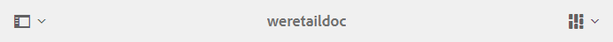
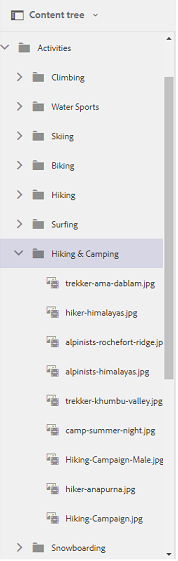

# Bläddra bland resurser på Brand Portal {#browsing-assets-on-brand-portal}

Experience Manager Assets Brand Portal har olika funktioner och element i användargränssnittet som gör det enkelt att bläddra bland resurser, navigera i resurshierarkier och söka efter resurser med olika visningsalternativ.

Experience Manager logotypen i verktygsfältet längst upp gör det lättare för administratörsanvändare att komma åt panelen Administrationsverktyg.

Rälsväljaren längst upp till vänster i listrutan Brand Portal visar alternativ för att navigera i resurshierarkier, effektivisera sökningar och visa resurser.

Du kan visa, navigera och välja resurser med någon av de tillgängliga vyerna (kort, kolumn och lista) i visningsväljaren för Brand Portal.

## Visa och välja resurser {#viewing-and-selecting-resources}

Att visa, navigera och markera var och en är begreppsmässigt detsamma i alla vyer, men har små variationer i hur de hanteras, beroende på vilken vy du använder.

Du kan visa, navigera i och välja (för ytterligare åtgärder) resurser med någon av de tillgängliga vyerna:

* Kolumnvy
* Kortvy
* Listvy

### Kortvy

I kortvyn visas informationskort för varje objekt på den aktuella nivån. Dessa kort innehåller följande information:

* En visuell representation av resursen/mappen.
* Typ
* Titel
* Namn
* Datum och tid när resursen publicerades till Brand Portal från AEM
* Storlek
* Dimensioner

Du kan navigera nedåt i hierarkin genom att klicka på kort (var noga med att inte utföra snabbåtgärderna) eller uppåt igen genom att använda [vägbeskrivningarna i sidhuvudet](https://experienceleague.adobe.com/sv/docs/experience-manager-65/content/sites/authoring/essentials/basic-handling).

#### Kortvy för icke-adminanvändare

Kort med mappar, i kortvyn, visar mapphierarkiinformation för icke-adminanvändare (Editor, Viewer och Guest User). Den här funktionen gör att användarna vet var mapparna de öppnar finns, i förhållande till den överordnade hierarkin.

Mapphierarkiinformation är särskilt användbar när du vill differentiera mappar som har namn som liknar andra mappar som delas från en annan mapphierarki. Om icke-adminanvändare inte känner till mappstrukturen för de resurser som delas med dem, verkar resurser/mappar med liknande namn förvirrande.

* De banor som visas på respektive kort trunkeras för att passa kortstorlekarna. Användarna kan dock se den fullständiga sökvägen som ett verktygstips genom att hålla markören över den trunkerade banan.

**Översiktsalternativ för att visa resursegenskaper**

Alternativet Översikt är tillgängligt för icke-adminanvändare (redigerare, visningsprogram, gästanvändare) om du vill visa resursegenskaper för valda resurser/mappar. Alternativet Översikt visas:

* Överst i verktygsfältet när du väljer en resurs/mapp.
* I listrutan när du väljer järnvägsväljaren.

När du väljer alternativet **[!UICONTROL Overview]** när en resurs/mapp är markerad kan användarna se titeln, sökvägen och tidpunkten när resursen skapades. På sidan med tillgångsinformation kan användarna se metadata för resursen genom att välja alternativet Översikt.

#### Visa inställningar i kortvyn

Dialogrutan **[!UICONTROL View Settings]** öppnas genom att du väljer **[!UICONTROL View Settings]** i vyväljaren. Du kan ändra storlek på miniatyrbilderna för resursen i kortvyn. På så sätt kan du anpassa visningen och styra antalet miniatyrbilder som visas.

### Listvy

I listvyn visas information för varje resurs på den aktuella nivån. I listvyn finns följande information:

* Miniatyrbild av resurser
* Namn
* Titel
* Språk
* Typ
* Dimension
* Storlek
* Klassificering
* Mappsökväg som visar resurshierarki
* Datum för publicering av resursen på Brand Portal

Med sökvägskolumnen är det enkelt att identifiera resursplats i mapphierarkin. Du kan navigera nedåt i hierarkin genom att klicka på resursnamnet och säkerhetskopiera genom att använda [vägbeskrivningar i rubriken](https://experienceleague.adobe.com/sv/docs/experience-manager-65/content/sites/authoring/essentials/basic-handling).

<!--
Comment Type: draft lastmodifiedby="mgulati" lastmodifieddate="2018-08-17T03:12:05.096-0400" type="annotation">Removed:- "Selecting assets in list view To select all items in the list, use the checkbox at the upper left of the list. When all items in the list are selected, this check box appears checked. To deselect all, click the checkbox. When only some items are selected, it appears with a minus sign. To select all, click the checkbox. To deselect all, click the checkbox again. You can change the order of items using the dotted vertical bar at the far right of each item in the list. Click the vertical selection bar and drag the item to a new position in the list."
 -->

### Visa inställningar i listvyn

I listvyn visas resursen **[!UICONTROL Name]** som första kolumn som standard. Ytterligare information, som resurs **[!UICONTROL Title]**, **[!UICONTROL Locale]**, **[!UICONTROL Type]**, **[!UICONTROL Dimensions]**, **[!UICONTROL Size]**, **[!UICONTROL Rating]**, publiceringsstatus visas också. Du kan dock välja vilka kolumner som ska visas med **[!UICONTROL View Settings]**.

### Kolumnvy

Använd kolumnvyn för att navigera i ett innehållsträd genom en serie överlappande kolumner. I den här vyn kan du visualisera och gå igenom resurshierarkin.

Om du väljer en resurs i den första kolumnen (längst till vänster) visas underordnade resurser i den andra kolumnen till höger. Om du väljer en resurs i den andra kolumnen visas underordnade resurser i den tredje kolumnen till höger och så vidare.

Du kan navigera uppåt och nedåt i trädet. Klicka på resursnamnet eller nedtryckningen till höger om resursnamnet.

* Resursnamnet och förvrängningen markeras när du klickar på det.
* Om du trycker eller klickar på miniatyrbilden markeras resursen.
* När du väljer det här alternativet läggs en bock över miniatyrbilden och resursnamnet markeras.
* Information om den valda resursen visas i den sista kolumnen.

När en resurs är markerad i kolumnvyn visas en visuell representation av resursen i den sista kolumnen tillsammans med följande information:

* Titel
* Namn
* Dimensioner
* Datum och tid när resursen publicerades till Brand Portal från AEM
* Storlek
* Typ
* Alternativet Mer information som finns på sidan med information om resursen

<!--
Comment Type: draft

<h3>Selecting Resources</h3>
-->

<!--
Comment Type: draft

Selecting a specific resource depends on a combination of the view and the device:

-->

<!--
Comment Type: draft

<table border="1" cellpadding="1" cellspacing="0" width="100%">
<tbody>
<tr>
<td> </td>
<td>Select</td>
<td>Deselect</td>
</tr>
<tr>
<td>Column View  </td>
<td>
<ul>
<li>Desktop:  Mouseover, then use the check mark quick action</li>
<li>Mobile device:  Tap the thumbnail</li>
</ul> </td>
<td>
<ul>
<li>Desktop:  Click the thumbnail</li>
<li>Mobile device:  Tap the thumbnail</li>
</ul> </td>
</tr>
<tr>
<td>Card View  </td>
<td>
<ul>
<li>Desktop:  Mouseover, then use the check mark quick action</li>
<li>Mobile device:  Tap-and-hold the card</li>
</ul> </td>
<td>
<ul>
<li>Desktop:  Click the card</li>
<li>Mobile device:  Tap the card</li>
</ul> </td>
</tr>
<tr>
<td>List View</td>
<td>
<ul>
<li>Desktop:  Mouseover, then use the check mark quick action</li>
<li>Mobile device:  Tap the thumbnail</li>
</ul> </td>
<td>
<ul>
<li>Desktop:  Click the thumbnail</li>
<li>Mobile device:  Tap the thumbnail</li>
</ul> </td>
</tr>
</tbody>
</table>
-->

<!--
Comment Type: draft

Deselecting All
-->

<!--
Comment Type: draft

In all cases, as you select items the count of the items selected is displayed at the upper right of the toolbar.

You can deselect all items and exit selection mode by clicking the X next to the count.

-->

<!--
Comment Type: draft

In all views, all items can be deselected by clicking escape on the keyboard if you are using a desktop device.

-->

## Innehållsträd {#content-tree}

Förutom dessa vyer använder du trädvyn för att gå nedåt i resurshierarkin samtidigt som du visar och väljer önskade resurser eller mappar.

Om du vill öppna trädvyn klickar du på rälsväljaren längst upp till vänster och väljer **[!UICONTROL Content tree]** på menyn.

Navigera från innehållshierarkin till önskad resurs.

## Tillgångsinformation {#asset-details}

På sidan med tillgångsinformation kan du visa en resurs, hämta, dela resursens länk, flytta den till en samling eller visa dess egenskapssida. Du kan även navigera på informationssidan för andra resurser i samma mapp i följd.

Om du vill visa resursens metadata, eller visa de olika återgivningarna, använder du spårväljaren på sidan med resursinformation.

Du kan visa alla tillgängliga återgivningar av resursen på sidan med resursinformation och välja en återgivning på panelen **[!UICONTROL Renditions]** för att förhandsgranska den.

<!-- removed as it is fixed in 2022.02.0 release
>[!CAUTION]
>
>(**Experience Manager Assets as a Cloud Service** only) The following known issues will be fixed in the upcoming release:
>
>The **[!UICONTROL Renditions]** panel does not list all the static renditions of the assets that are published to Brand Portal after December 16, 2021.
>
>The **[!UICONTROL Renditions]** panel lists the smart crop renditions of the asset, however, the user cannot preview or download the smart crop renditions.
-->

Om du vill öppna sidan med resursegenskaper använder du alternativet **[!UICONTROL Properties (p)]** i det övre fältet.

Du kan också visa en lista över alla dess relaterade resurser (källresurser eller härledda resurser på AEM) på egenskapssidan för en resurs, eftersom resursrelationen också publiceras från AEM till Brand Portal.
