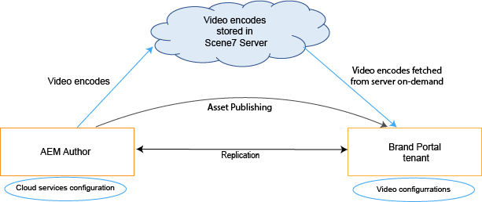

# Dynamiskt videostöd i Brand Portal {#dynamic-video-support-on-brand-portal}

Förgranska och spela upp videor på ett anpassat sätt på Brand Portal med Dynamic Media support. Hämta även dynamiska återgivningar från portalen och delade länkar.
Brand Portal kan

* Förhandsgranska videoklipp på sidan Resursinformation, i kortvyn och på sidan för förhandsgranskning av länkdelning.
* Spela upp videokodningar på sidan Resursinformation.
* Visa dynamiska återgivningar på fliken Återgivningar på sidan Resursinformation.
* Ladda ned videokoder och mappar med videoklipp.

>[!NOTE]
>
>Om du vill arbeta med videoklipp och publicera dem på Brand Portal kontrollerar du att författarinstansen för Experience Manager är inställd i Dynamic Media Hybrid-läge eller Dynamic Media **[!DNL Scene7]**-läge.

För att förhandsgranska, spela upp och ladda ned videor visar Brand Portal följande två konfigurationer för administratörer:

* [Dynamic Media Hybrid-konfiguration](#configure-dm-hybrid-settings)
Om Experience Manager Author-instansen körs i läget Dynamic Media Hybrid.
* [Dynamic Media [!DNL Scene7] configuration](#configure-dm-scene7-settings)
Om Experience Manager Author-instansen körs i läget för dynamiska media **[!DNL Scene7]** .
Ange någon av dessa konfigurationer baserat på de konfigurationer som du anger i din Experience Manager Author-instans som Brand Portal-klientorganisationen replikeras med.

>[!NOTE]
>
>Dynamiska videor stöds inte på Brand Portal-klientorganisationer som har konfigurerats med Experience Manager Author som körs i körläge **[!UICONTROL Scene7Connect]**.

## Hur spelas dynamiska videor upp? {#how-are-dynamic-videos-played}

Om Dynamic Media-konfigurationer ([Hybrid](../using/dynamic-video-brand-portal.md#configure-dm-hybrid-settings) eller [[!DNL Scene7]](../using/dynamic-video-brand-portal.md#configure-dm-scene7-settings) konfigurationer) har konfigurerats på Brand Portal hämtas de dynamiska återgivningarna från **[!DNL Scene7]**-servern. Videokodningar förhandsvisas och spelas upp utan fördröjning och kvalitetsförvrängning.

Eftersom videokodningar inte lagras i Brand Portal-databasen och hämtas från **[!DNL Scene7]**-servern måste du se till att Dynamic Media-konfigurationerna på Adobe Experience Manager Author Instance och Brand Portal är desamma.

>[!NOTE]
>
>Videovisningsprogram och visningsförinställningar stöds inte i Brand Portal. Videor förhandsvisas och spelas upp på standardvisningsprogrammen i Brand Portal.

## Förutsättningar {#prerequisites}

Om du vill arbeta med dynamiska videoklipp på Brand Portal måste du se till att:

* **Starta Experience Manager Author i Dynamic Media-läge**
Starta Experience Manager Author-instansen (som Brand Portal är konfigurerat med) antingen i [Dynamic Media - [!DNL Scene7] läge](https://experienceleague.adobe.com/docs/experience-manager-65/assets/dynamic/config-dms7.html?lang=en#enabling-dynamic-media-in-scene-mode) eller i [Dynamic Media - hybrid-läge](https://experienceleague.adobe.com/docs/experience-manager-65/assets/dynamic/config-dynamic.html) eller
* **Konfigurera Dynamic Media-Cloud Service på författaren till Experience Manager**
Baserat på Dynamic Media-läget (Scene7-läge eller hybridläge) körs Experience Manager Author, anger du antingen [ Dynamic Media-Cloud Service ([!DNL Scene7] mode) ](https://experienceleague.adobe.com/docs/experience-manager-65/assets/dynamic/config-dms7.html?lang=en#configuring-dynamic-media-cloud-services) eller [Dynamic Media-Cloud Service (hybridläge) ](https://experienceleague.adobe.com/docs/experience-manager-65/assets/dynamic/config-dynamic.html?lang=en#configuring-dynamic-media-cloud-services) på Experience Manager Author från **Verktyg** | **Cloud Service** | **Dynamic Media** .
* **Konfigurera Dynamic Media på Brand Portal**
Baserat på Dynamic Media molnkonfigurationer på Experience Manager Author konfigurerar du [Dynamic Media-inställningar](#configure-dm-hybrid-settings) eller [[!DNL Scene7] inställningar](#configure-dm-scene7-settings) från Brand Portal administrationsverktyg.
Kontrollera att [separata Brand Portal-klientorganisationer](#separate-tenants) används för Experience Manager Author-instanser som har konfigurerats i Dynamic Media - **[!UICONTROL Scene7]** och Dynamic Media - hybrid-läge. Speciellt om du använder funktioner i Dynamic Media **[!UICONTROL S7]** och Dynamic Media Hybrid.
* **Publish-mappar med videokodning tillämpade på Brand Portal**
Använd [ videokodning ](https://experienceleague.adobe.com/docs/experience-manager-65/assets/dynamic/video-profiles.html) och publicera mappen med multimedieresurser från Experience Manager Author-instansen till Brand Portal.
* **Tillåtslista IP-adresser i SPS om säker förhandsvisning är aktiverat**
Om du använder Dynamic Media-**[!DNL Scene7]** (med [ säker förhandsgranskning aktiverad ](https://experienceleague.adobe.com/docs/dynamic-media-classic/using/upload-publish/testing-assets-making-them-public.html) för ett företag) bör **[!DNL Scene7]** företagsadministratören [tillåtslista IP-adresserna för den offentliga utgången ](https://experienceleague.adobe.com/docs/dynamic-media-classic/using/upload-publish/testing-assets-making-them-public.html#testing-the-secure-testing-service) för respektive region med hjälp av SPS-gränssnittet (**[!UICONTROL Scene7]** Publishing System).
IP-adresserna för Egress är följande:

| **Region** | **Utreses-IP** |
|--- |--- |
| NA | 130.248.160.68, 20.94.203.130 |
| EMEA | 185.34.189.3, 51.132.146.75 |
| APAC | 63.140.44.54 |

Information om hur du tillåtslista någon av dessa utgående IP:n finns i [Förbered ditt konto för säker testningstjänst](https://experienceleague.adobe.com/docs/dynamic-media-classic/using/upload-publish/testing-assets-making-them-public.html#testing-the-secure-testing-service).

## Bästa praxis

Följ de här stegen för att se till att dina dynamiska videomaterial förhandsvisas, spelas upp och hämtas från Brand Portal (och delade länkar):

### Separata innehavare för lägena Dynamic Media - Scene7 och Dynamic Media - Hybrid {#separate-tenants}

Om du använder både Dynamic Media - **[!DNL Scene7]**-läget och Dynamic Media - hybridläget, ska du använda olika Brand Portal-klientorganisationer för Experience Manager Author-instanser som konfigurerats med Dynamic Media - **[!DNL Scene7]** och Dynamic Media - hybridläget.

### Samma konfigurationsinformation på Experience Manager Author-instansen och Brand Portal

Se till att konfigurationsinformationen är densamma i Brand Portal och **[!UICONTROL Experience Manager Cloud Configuration]**. Samma konfigurationsinformation omfattar följande:

* **[!UICONTROL Title]**
* **[!UICONTROL Registration ID]**
* **[!UICONTROL Video Service URL]** i **[!UICONTROL Dynamic Media - Hybrid mode]**
* **[!UICONTROL Title]**
* Autentiseringsuppgifter (**[!UICONTROL Email]** och lösenord)
* **[!UICONTROL Region]**
* **[!UICONTROL Company]** i Dynamic Media - **[!DNL Scene7]**-läge

### Tillåtelselista publika IP-adresser för utgångar för Dynamic Media Scene7-läge

Om [-skyddad ](https://experienceleague.adobe.com/docs/dynamic-media-classic/using/upload-publish/testing-assets-making-them-public.html)-förhandsvisning som har Dynamic Media **[!UICONTROL Scene7]** aktiverat används för att skicka videomaterial till Brand Portal skapar **[!UICONTROL Scene7]** en dedikerad bildserver för mellanlagringsmiljöer eller interna program. Alla förfrågningar till den här servern kontrollerar den ursprungliga IP-adressen. Om den inkommande begäran inte finns i den godkända listan över IP-adresser returneras ett felsvar.
Företagsadministratören **[!UICONTROL Scene7]** konfigurerar därför en godkänd lista över IP-adresser för företagets **[!UICONTROL Secure Testing]**-miljö via Flash-gränssnittet **[!UICONTROL SPS]** (Scene7 Publishing System). Se till att IP-adressen för utgångar för din respektive region (från följande) läggs till i den godkända listan.
Information om hur du tillåtslista någon av dessa utgående IP:n finns i [Förbered ditt konto för säker testningstjänst](https://experienceleague.adobe.com/docs/dynamic-media-classic/using/upload-publish/testing-assets-making-them-public.html#testing-the-secure-testing-service).
IP-adresserna för utgångar är följande:

| **Region** | **Utreses-IP** |
|--- |--- |
| NA | 130.248.160.68, 20.94.203.130 |
| EMEA | 51.132.146.75, 130.248.244.202, 130.248.244.203, 130.248.244.204, 130.2 48.244.210, 130.248.244.211, 130.248.244.212 |
| APAC | 63.140.44.54 |

## Konfigurera inställningar för Dynamic Media (Hybrid) {#configure-dm-hybrid-settings}

Om Experience Manager Author-instansen körs i läget för dynamisk medietyp använder du **[!UICONTROL Video]**-panelen från panelen Administrationsverktyg för att konfigurera Dynamic Media gateway-inställningarna.

>[!NOTE]
>
>[videokodningsprofilerna](https://experienceleague.adobe.com/docs/experience-manager-65/assets/dynamic/video-profiles.html) publiceras inte till Brand Portal, utan hämtas från **[!UICONTROL Scene7]**-servern. För att videokodningar ska kunna spelas upp i Brand Portal måste därför konfigurationsinformationen vara densamma som [Dynamic Media-Cloud Servicen ([!DNL Scene7] mode)](https://experienceleague.adobe.com/docs/experience-manager-65/assets/dynamic/config-dms7.html?lang=en#configuring-dynamic-media-cloud-services) i Experience Manager Author-instansen.

Så här konfigurerar du Dynamic Media-konfigurationer för Brand Portal-klienter:

1. Markera Experience Manager-logotypen så att du kan komma åt administrationsverktygen från verktygsfältet längst upp i Brand Portal.
1. Välj **[!UICONTROL Video]**-rutan på panelen Administrationsverktyg.

   

   **[!UICONTROL Edit Dynamic Media Configuration]** sida öppnas.

   

1. Ange **[!UICONTROL Registration ID]** och **[!UICONTROL Video Service URL]** (URL för DM-gateway). Se till att dessa uppgifter är samma som de som finns i **[!UICONTROL Tools > Cloud Services]** i din Experience Manager Author-instans.
1. Välj **Spara** om du vill spara konfigurationen.

## Konfigurera inställningar för Dynamic Media Scene7 {#configure-dm-scene7-settings}

Om Experience Manager Author-instansen körs i Dynamic Media- **[!UICONTROL Scene7]**-läge använder du **[!UICONTROL Dynamic Media Configuration]** sida vid sida på panelen Administrationsverktyg för att konfigurera serverinställningarna för **[!UICONTROL Scene7]**.

Så här konfigurerar du Dynamic Media **[!UICONTROL Scene7]**-konfigurationer för Brand Portal-klientorganisationer:

1. Markera Experience Manager-logotypen så att du kan komma åt administrationsverktygen från verktygsfältet längst upp i Brand Portal.

2. Välj **[!UICONTROL Dynamic Media Configuration]**-rutan på panelen Administrationsverktyg.

   ![DM [!UICONTROL Scene 7]-konfiguration på Brand Portal](assets/DMS7-Tile.png)

   **[!UICONTROL Edit Dynamic Media Configuration]** sida öppnas.

   

3. Ange:

   * **[!UICONTROL Title]**
   * Autentiseringsuppgifter (**[!UICONTROL Email ID]** och **[!UICONTROL Password]**) för åtkomst till Scene7-servern
   * **[!UICONTROL Region]**

   Se till att dessa värden är desamma som de som finns i Experience Manager Author-instansen.

4. Välj **[!UICONTROL Connect to Dynamic Media]**.

5. Ange **[!UICONTROL Company name]** och **[!UICONTROL Save]** konfigurationen.
