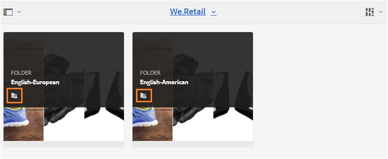

# Gäståtkomst till Brand Portal {#guest-access-to-brand-portal}

Experience Manager Assets Brand Portal ger gästerna åtkomst till portalen. En gästanvändare behöver inga autentiseringsuppgifter för att gå in i portalen och har tillgång till portalens offentliga resurser (och samlingar). Användare i gästsessionen kan lägga till resurser i ljuslådan (privat samling) och hämta samma tills deras session varar eller om inte gästanvändaren väljer att [[!UICONTROL End Session]](#exit-guest-session). En gästanvändarsession är aktiv i 15 minuter.

Med gäståtkomstfunktionen kan organisationer [dela godkända resurser snabbt](../using/brand-portal-sharing-folders.md#how-to-share-folders) med den avsedda målgruppen i stor skala utan att behöva lägga in dem. Brand Portal 6.4.2 och senare är utrustat för flera samtidiga gästanvändare, vilket är 10 % av den totala användarkvoten per organisation. Genom att ge gäståtkomst sparar du tid för att hantera och lägga in poäng för användare med begränsade funktioner på Brand Portal.\
Organisationer kan aktivera (eller inaktivera) gäståtkomst på organisationens Brand Portal-konto med alternativet **[!UICONTROL Allow Guest Access]** i inställningarna för **[!UICONTROL Access]** på panelen Administrationsverktyg.

<!--
Comment Type: annotation
Last Modified By: mgulati
Last Modified Date: 2018-08-17T10:42:59.879-0400
Removed the first para: "AEM Assets Brand Portal allows public users to enter the portal anonymously and have restricted access to the allowed public resources as guests. Organization users with guest role need not seek access and authentication from administrators."
-->

## Starta gästsession {#begin-guest-session}

Om du vill ange Brand Portal anonymt väljer du **[!UICONTROL Click here]** som motsvarar **[!UICONTROL `Guest Access?`]** på Brand Portal välkomstskärm. Ange säkerhetskontrollen captcha för att ge åtkomst till Brand Portal.

## Gästsessionens varaktighet {#guest-session-duration}

En gästanvändarsession är aktiv i 15 minuter.
Den här processen bevarar tillståndet för **[!UICONTROL Lightbox]** i 15 minuter från sessionens starttid. Efter det startas den aktuella gästsessionen om, vilket gör att ljuslådeläget går förlorat.

En gästanvändare loggar till exempel in på Brand Portal 1 500 timmar och lägger till resurser i **[!UICONTROL Lightbox]** för hämtning kl. 15:05 timmar. Om användaren inte hämtar samlingen **[!UICONTROL Lightbox]** (eller dess resurser) före 15:15 timmar (inom 15 minuter efter inloggning) måste användaren starta om sessionen. **[!UICONTROL Lightbox]** är tom, vilket innebär att de överförda resurserna inte längre är tillgängliga om sessionen förlorades.

## Samtidiga gästsessioner tillåts {#concurrent-guest-sessions-allowed}

Antalet samtidiga gästsessioner är begränsat till 10 % av den totala användarkvoten per organisation. Det innebär att för en organisation med en användarkvot på 200 kan högst 20 gästanvändare arbeta samtidigt. Den 21:a användaren nekas åtkomst och kan bara komma åt som gäst om sessionen för någon av de 20 aktiva gästanvändarna avslutas.

>[!NOTE]
>
>Brand Portal skickar inget meddelande om antalet licensierade användare överstiger det avtalade värdet (kvoten). Den begränsar inte heller någon aktivitet för de licensierade användarna.

## Gästanvändarinteraktion med Brand Portal {#guest-user-interaction-with-brand-portal}

### Navigering för gästanvändargränssnitt

När användare anger Brand Portal som gäst kan de se alla [resurser och mappar som delas](../using/brand-portal-sharing-folders.md#sharefolders) offentligt eller endast med gästanvändare. Den här vyn är endast innehållsvyn, som visar resurser på ett av kort-, list- eller kolumnlayouterna.

Om administratörer aktiverar [Aktivera mapphierarki](../using/brand-portal-general-configuration.md#main-pars-header-1621071021) kan gästanvändare se mappträdet från rotmappen och delade mappar i sina överordnade mappar när de loggar in i Brand Portal.

De här överordnade mapparna är virtuella mappar och inga åtgärder kan utföras på dem. Du känner igen dessa virtuella mappar med en låsikon.

Inga åtgärder visas när du hovrar eller markerar dem i **[!UICONTROL Card View]**, till skillnad från delade mappar. Knappen **[!UICONTROL Overview]** visas när du väljer en virtuell mapp i **[!UICONTROL Column View]** och **[!UICONTROL List View]**.

>[!NOTE]
>
>Standardminiatyrbilden för de virtuella mapparna är miniatyrbilden för den första delade mappen.

   

Med alternativet **[!UICONTROL View Settings]** kan gästanvändarna justera kortstorlekar i **[!UICONTROL Card View]** eller kolumner som ska visas i **[!UICONTROL List View]**.

Med **[!UICONTROL Content tree]** kan du gå igenom resurshierarkin.

Brand Portal tillhandahåller ett **[!UICONTROL Overview]**-alternativ för gästanvändare så att de kan visa **[!UICONTROL Asset Properties]** valda resurser/mappar. Alternativet **[!UICONTROL Overview]** är synligt:

* Överst i verktygsfältet när du väljer en resurs eller mapp.
* I listrutan när du väljer Järnvägsväljaren.

När du väljer alternativet **[!UICONTROL Overview]** när en resurs eller mapp är markerad kan användarna se titeln, sökvägen och tidpunkten när resursen skapades. Om du väljer alternativet **[!UICONTROL Overview]** på sidan med tillgångsinformation kan användarna se metadata för resursen.

Alternativet **[!UICONTROL Navigation]** i den vänstra listen gör det möjligt att navigera från filer till samlingar och tillbaka i gästsessionen så att användarna kan bläddra bland resurserna i filer och samlingar.

Med alternativet **[!UICONTROL Filter]** kan gästanvändare filtrera resursfiler och mappar med hjälp av sökpredikat som angetts av administratören.

### Gästanvändarfunktioner

Gästanvändare har åtkomst till offentliga resurser på Brand Portal och har också få begränsningar som beskrivs vidare.

**Gästanvändare kan**:

* Få tillgång till alla gemensamma mappar och samlingar som är avsedda för alla Brand Portal-användare.
* Bläddra bland medlemmar, detaljsidor och ha en fullständig resursvy över medlemmarna i alla gemensamma mappar och samlingar.
* Sök resurser i gemensamma mappar och samlingar.
* Lägg till resurser i ljuslådesamlingen. Dessa ändringar i samlingen kvarstår under sessionen.
* Ladda ned material direkt eller via en ljuslådesamling.

**Gästanvändare kan inte**:

* Skapa samlingar och sparade sökningar, eller dela dem ytterligare.
* Få åtkomst till inställningar för mappar och samlingar.
* Dela resurser som länkar.

### Hämta resurser i gästsession

Gästanvändare kan direkt hämta resurser som delas offentligt eller exklusivt med gästanvändare på Brand Portal. Gästanvändare kan också lägga till resurser i **[!UICONTROL Lightbox]** (offentlig samling) och hämta samlingen **[!UICONTROL Lightbox]** innan deras session upphör.

Om du vill hämta resurser och samlingar använder du hämtningsikonen från:

* Miniatyrbilder för snabbåtgärd, som visas när du håller pekaren över resursen eller samlingen
* Verktygsfältet längst upp, som visas när du väljer en resurs eller samling

Om du väljer **[!UICONTROL Enable download acceleration]** i dialogrutan [!UICONTROL Download] kan du [förbättra hämtningsprestanda](../using/accelerated-download.md).

## Avsluta gästsession {#exit-guest-session}

Om du vill avsluta en gästsession använder du **[!UICONTROL End Session]** bland de tillgängliga alternativen i sidhuvudet. Om webbläsarfliken som används för gästsessionen är inaktiv upphör sessionen automatiskt efter två timmars inaktivitet.

## Övervaka gästanvändaraktiviteter {#monitoring-guest-user-activities}

Administratörer kan övervaka gästanvändarinteraktion med Brand Portal. Rapporter som genereras i Brand Portal kan ge viktiga insikter om gästanvändaraktiviteter. Rapporten **[!UICONTROL Download]** kan till exempel användas för att spåra antalet resurser som hämtats av gästanvändaren. **[!UICONTROL User Logins]**-rapporten kan informera om när gästanvändaren senast loggade in på portalen och hur ofta inloggningar ska ske under en viss tid.
