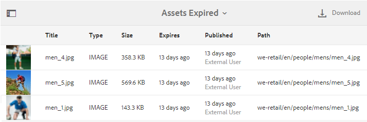

# Hantera digitala rättigheter för resurser {#manage-digital-rights-of-assets}

För att skydda ert varumärke är det viktigt att säkerställa säker distribution och användning av kreativa tillgångar och varumärkesmaterial. Den här processen kan genomföras genom att ett förfallodatum (och en förfallotid) kopplas till godkända mediefiler som publiceras från AEM till Brand Portal, eller genom att dessa mediefiler licensieras för villkorlig användning. I Brand Portal kan du också ange ett förfallodatum för länkar till resurser som delas från Brand Portal.

Läs vidare för att lära dig hur materialet skyddas på Brand Portal och förstå de tillhörande användningsbehörigheterna.

## Resursens förfallodatum {#asset-expiration}

Att mediefiler förfaller är ett effektivt sätt att kontrollera användningen av godkända mediefiler på Brand Portal i en hel organisation. Alla mediefiler som publiceras från AEM Assets till Brand Portal kan ha ett förfallodatum, vilket begränsar användningen av dessa mediefiler från olika användarroller.

### Användningsbehörigheter för resurser som gått ut {#usage-permissions-expired-assets}

I Brand Portal kan administratörer visa, ladda ned och lägga till material som gått ut i samlingar. Redigerare och visningsprogram kan dock bara visa och lägga till utgångna resurser i samlingar.

Administratörer kan publicera material som gått ut från AEM Assets till Brand Portal. Utgångna resurser kan dock inte delas via en länk från Brand Portal. Om du väljer en resurs som har gått ut från en mapp som innehåller resurser som har gått ut och som inte har gått ut, är åtgärden **[!UICONTROL Share Link]** inte tillgänglig. Men om du väljer en mapp som innehåller resurser som har gått ut och som inte gått ut är åtgärderna [!UICONTROL Share] och **[!UICONTROL Share Link]** tillgängliga.

>[!NOTE]
>
>En mapp kan fortfarande delas som en länk, även om den innehåller resurser som har gått ut. I det här fallet listar länken inte resurser som har gått ut och bara resurser som inte har gått ut delas.

I följande tabell visas användningsbehörigheterna för utgångna resurser:

|   | **[!UICONTROL Link share]** | **[!UICONTROL Download]** | **[!UICONTROL Properties]** | **[!UICONTROL Add to collection]** | **[!UICONTROL Delete]** |
|---|---|---|---|---|---|
| **[!UICONTROL Administrator]** | Otillgänglig | Tillgänglig | Tillgänglig | Tillgänglig | Tillgänglig |
| **[!UICONTROL Editor]** | Otillgänglig | Otillgänglig | Tillgänglig | Tillgänglig | Otillgänglig |
| **[!UICONTROL Viewer]** | Otillgänglig | Otillgänglig | Tillgänglig | Tillgänglig | Otillgänglig |
| **[!UICONTROL Guest user]** | Otillgänglig | Otillgänglig | Tillgänglig | Tillgänglig | Otillgänglig |

>[!NOTE]
>
>Om visningsprogram och redigerare hämtar en mapp med resurser som har upphört att gälla och som inte har gått ut, hämtas endast de resurser som inte har gått ut. Om en mapp bara innehåller resurser som har gått ut hämtas en tom mapp.

### Utgångsstatus för tillgångar {#expiration-status-of-assets}

Du kan visa förfallostatusen för resurser i deras **[!UICONTROL Card View]**. En röd flagga på kortet anger att resursen har gått ut.

>[!NOTE]
>
>I list- och kolumnvyer visas inte tillgångarnas förfallostatus.

## Resurslänkens förfallodatum {#asset-link-expiration}

När du delar resurser via länkar kan administratörer och redigerare ange ett förfallodatum och en förfallotid med hjälp av fältet **[!UICONTROL Expiration]** i dialogrutan **[!UICONTROL Link Sharing]**. Länkens standardförfallodatum är sju dagar från det datum då länken delas.

Det ser till att resurser som delas som länkar förfaller vid det datum och den tidpunkt som anges av Brand Portal administratörer och redigerare. Och resurserna kan inte längre visas och laddas ned efter förfallodatumet. För att skydda dina godkända resurser från externa användare anger du ett förfallodatum för delade länkar för att säkerställa att de inte exponeras för okända enheter efter en viss tid.

Mer information om länkdelning finns i [Dela resurser som en länk](../using/brand-portal-link-share.md).

## Licensierad Assets {#licensed-assets}

För licensierade mediefiler krävs att ett licensavtal godkänns innan du laddar ned dem från Brand Portal. Det här avtalet för licensierade mediefiler levereras när du hämtar mediefilen direkt från Brand Portal eller via en delad länk. Oavsett om avtalet har gått ut eller inte kan alla användare visa licensskyddade resurser. Hämtningen och användningen av licensierade mediefiler som upphört att gälla är dock begränsad. Om du vill veta mer om beteendet hos utgångna licensierade resurser och tillåtna aktiviteter baserat på användarroller kan du läsa [användningsbehörigheter för utgångna resurser](../using/manage-digital-rights-of-assets.md#usage-permissions-expired-assets).

Licensskyddade resurser har ett [licensavtal kopplat](https://experienceleague.adobe.com/sv/docs/experience-manager-65/content/assets/administer/drm) till sig, vilket görs genom att resursens metadataegenskap ställs in i [!DNL Experience Manager Assets].

En resurs betraktas som skyddad om den innehåller någon av följande (eller båda) metadataegenskaper:

* `xmpRights:WebStatement`: Den här egenskapen refererar till sökvägen till sidan som innehåller licensavtalet för resursen. `xmpRights:WebStatement` ska vara en giltig sökväg i databasen.
* `adobe_dam:restrictions`: Värdet för den här egenskapen är ett obearbetat HTML som anger licensavtalet.

Om du väljer att hämta licensskyddade resurser omdirigeras du till sidan **[!UICONTROL Copyright Management]** beroende på metadataegenskaperna.

| `adobe_dam:restrictions` | `xmpRights:WebStatement` | Copyrighthantering |
| --- | --- | --- |
| Ja | - | Gränssnittet visas i både Assets och Brand Portal |
| - | Ja (ogiltig sökväg) | Inget gränssnitt |
| Ja | Ja (ogiltig sökväg) | Inget gränssnitt |
| Ja | Ja (giltig sökväg) | Gränssnittet visas i Assets eller Brand Portal Beroende på om sökvägen är giltig för Assets eller Brand Portal (eller båda). |

Här måste du välja resursen för att hämta och godkänna det associerade licensavtalet. Om du inte godkänner licensavtalet är knappen **[!UICONTROL Download]** inte aktiverad.

Om markeringen innehåller flera skyddade resurser markerar du en resurs i taget, godkänner licensavtalet och fortsätter att hämta resursen.

## Generera en rapport över förfallna resurser {#generate-report-about-expired-assets}

Administratörer kan generera och ladda ned en rapport med en lista över alla mediefiler som gått ut inom en viss tidsram. Den här rapporten innehåller detaljerad information - som storlek, typ, sökväg som anger resursens placering i resurshierarkin, när tillgången förföll och när den publicerades - om de förfallna tillgångarna. Kolumnerna i den här rapporten kan anpassas för att visa mer data baserat på användarkrav.

Mer information om rapportfunktionen finns på [Arbeta med rapporter](../using/brand-portal-reports.md#work-with-reports).
