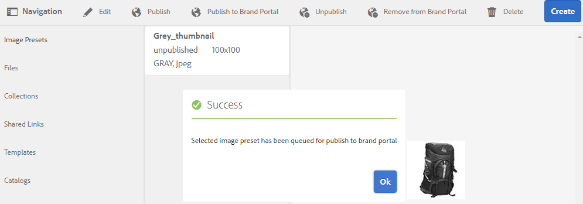

# Publish-förinställningar, schema och ansikten för Brand Portal {#publish-presets-schema-and-facets-to-brand-portal}

Artikeln tar bort publicering av bildförinställningar, metadataram och anpassade sökfaktorer från AEM Author-instans till Brand Portal. Med publiceringsfunktionen kan organisationer återanvända bildförinställningar, metadatamatcheman och sökfaktorer som skapats eller redigerats i en AEM Author-instans. Det här arbetssättet minskar dubbelarbete.

>[!NOTE]
>
>Möjligheten att publicera bildförinställningar, metadataram och sökfaktorer från AEM Author-instans till Brand Portal finns från och med AEM 6.2 SP1-CFP7 och AEM 6.3 SP 1-CFP 1 (6.3.1.1).

## Publish bildförinställningar till Brand Portal {#publish-image-presets-to-brand-portal}

Bildförinställningar är en uppsättning kommandon för storleksändring och formatering som används på bilden när bilden levereras. Du kan skapa och ändra bildförinställningar på Brand Portal. Om en AEM Author-instans körs i Dynamic Media-läge kan användare även skapa förinställningar i AEM Author och publicera dem på AEM Assets Brand Portal. På så sätt undviker du att återskapa samma förinställningar på Brand Portal.
När förinställningen har skapats visas den som en dynamisk återgivning på resursdetaljrenderingslisten och i hämtningsdialogrutan.

>[!NOTE]
>
>Om AEM Author-instansen inte körs i **[!UICONTROL Dynamic Media Mode]** (kunden har inte köpt Dynamic Media), skapas inte **[!UICONTROL Pyramid TIFF]**-återgivningen av resurserna vid överföringen. Bildförinställningar eller dynamiska återgivningar fungerar på **[!UICONTROL Pyramid TIFF]** för en resurs. Om **[!UICONTROL Pyramid TIFF]** inte är tillgänglig på AEM Author-instansen är den därför inte tillgänglig på Brand Portal. Därför finns det inga dynamiska återgivningar i återgivningsfältet på sidan med resursinformation och i dialogrutan för hämtning.

Så här publicerar du bildförinställningar till Brand Portal:

1. I AEM Author-instansen klickar du på den AEM logotypen för att komma åt den globala navigeringskonsolen, klickar på verktygsikonen och navigerar till **[!UICONTROL Assets > Image Presets]**.
1. Välj bildförinställningen eller flera bildförinställningar i listan med bildförinställningar och klicka på **[!UICONTROL Publish to Brand Portal]**.

>[!NOTE]
>
>När användare klickar på **[!UICONTROL Publish to Brand Portal]** köas bildförinställningarna för publicering. Användarna uppmanas att övervaka loggen för replikeringsagenterna för att bekräfta om publiceringen lyckades.

Så här avpublicerar du en bildförinställning från Brand Portal:

1. I AEM Author-instansen klickar du på den AEM logotypen för att komma åt den globala navigeringskonsolen, klickar på ikonen **[!UICONTROL Tools]** och navigerar till **[!UICONTROL Assets > Image Presets]**.
1. Välj en bildförinställning och välj **[!UICONTROL Remove from Brand Portal]** bland de tillgängliga alternativen högst upp.

## Publish metadatamatchema för Brand Portal {#publish-metadata-schema-to-brand-portal}

Metadata-schemat beskriver layouten och egenskaperna som visas på egenskapssidan för resurser/samlingar.

 

Om användare redigerade standardschemat på en AEM Author-instans och vill använda samma schema som standardschemat på Brand Portal, publicerar du metadatamappningsformulären till Brand Portal. I så fall åsidosätter standardscheman som publiceras från AEM Author-instansen standardschemat på Brand Portal.

Om användare har skapat ett anpassat schema AEM författarinstansen kan de publicera det anpassade schemat till Brand Portal i stället för att återskapa samma anpassade schema där. Användarna kan sedan använda det här anpassade schemat för alla mappar/samlingar i Brand Portal.

>[!NOTE]
>
>Standardscheman kan inte publiceras till Brand Portal om de är låsta vid AEM. De redigeras alltså inte.

>[!NOTE]
>
>Om en mapp har ett schema AEM författarinstansen måste samma schema också finnas på Brand Portal. På så sätt blir det lättare att bibehålla enhetligheten på egenskapssidan AEM författare och Brand Portal.

Så här publicerar du ett metadataschema från AEM Author-instans till Brand Portal:

1. I AEM Author-instansen klickar du på den AEM logotypen för att komma åt den globala navigeringskonsolen, klickar på verktygsikonen och navigerar till **[!UICONTROL Assets > Metadata Schemas]**.
1. Välj ett metadataschema och välj **[!UICONTROL Publish to Brand Portal]** bland de tillgängliga alternativen högst upp.

>[!NOTE]
>
>När användare klickar på **[!UICONTROL Publish to Brand Portal]** köas metadatamodeller för publicering. Användarna uppmanas att övervaka loggen för replikeringsagenterna för att bekräfta om publiceringen lyckades.

Så här avpublicerar du ett metadataschema från Brand Portal:

1. I AEM Author-instansen klickar du på den AEM logotypen för att komma åt den globala navigeringskonsolen, klickar på verktygsikonen och navigerar till **[!UICONTROL Assets > Metadata Schemas]**.
1. Välj ett metadataschema och välj **[!UICONTROL Remove from Brand Portal]** bland de tillgängliga alternativen högst upp.

## Publish sökfack till Brand Portal {#publish-search-facets-to-brand-portal}

Sökformulär kan användas för [fasetterad sökning](../using/brand-portal-search-facets.md) för användare på Brand Portal. Sökfacets ger större granularitet åt sökningar i Brand Portal. Alla [predikat som läggs till](https://experienceleague.adobe.com/sv/docs/experience-manager-65/content/assets/administer/search-facets) i sökformuläret är tillgängliga för användare som sökfaktorer i sökfilter.

Om du vill använda ett anpassat sökformulär på **[!UICONTROL Assets Admin Search Rail]** från AEM författarinstans publicerar du det direkt till Brand Portal i stället för att återskapa det.

>[!NOTE]
>
>Om du vill publicera ett låst sökformulär på **[!UICONTROL Assets Admin Search Rail]** från AEM Assets till Brand Portal måste du först redigera det. När sökformuläret har redigerats och publicerats åsidosätter det det befintliga sökformuläret på Brand Portal.

Så här publicerar du den redigerade sökaspekten från AEM Author-instansen till Brand Portal:

1. Klicka på AEM logotyp och gå sedan till **[!UICONTROL Tools > General > Search Forms]**.
1. Markera det redigerade sökformuläret och välj **[!UICONTROL Publish to Brand Portal]**.

   >[!NOTE]
   >
   >När användare klickar på **[!UICONTROL Publish to Brand Portal]** står sökfunktionerna i kö för publicering. Användarna uppmanas att övervaka loggen för replikeringsagenterna för att bekräfta om publiceringen lyckades.

Så här avpublicerar du sökformulär från Brand Portal:

1. I AEM Author-instansen klickar du på den AEM logotypen för att komma åt den globala navigeringskonsolen, klickar på verktygsikonen och navigerar till **[!UICONTROL General > Search Forms]**.
1. Markera sökformuläret och välj **[!UICONTROL Remove from Brand Portal]** bland de tillgängliga alternativen överst.

>[!NOTE]
>
>Åtgärden **[!UICONTROL Unpublish from Brand Portal]** lämnar standardsökformuläret på Brand Portal och återställer inte det sökformulär som användes före publiceringen.

### Begränsningar {#limitations}

1. Ett fåtal sökpredikat kan inte användas för sökfilter på Brand Portal. När de här sökpredikaten publiceras som en del av sökformuläret från AEM Author-instansen till Brand Portal, filtreras de bort. Användarna ser därför färre antal predikt i det publicerade formuläret på Brand Portal. Se [sökpredikat som kan tillämpas på filter i Brand Portal](../using/brand-portal-search-facets.md#list-of-search-predicates).

1. Om en användare använder en anpassad sökväg för att läsa alternativ på en AEM författarinstans för [!UICONTROL Options Predicate] fungerar den inte på Brand Portal. Dessa ytterligare sökvägar och alternativ publiceras inte till Brand Portal med sökformuläret. I så fall kan användare välja alternativet **[!UICONTROL Manual]** i **[!UICONTROL Add Options]** inom **[!UICONTROL Options Predicate]** för att lägga till dessa alternativ manuellt på Brand Portal.

