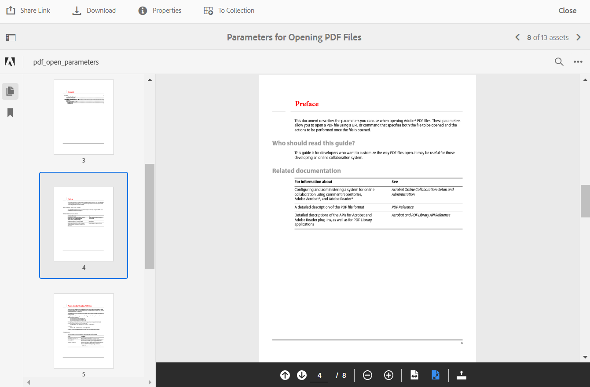

# Nyheter i Experience Manager Assets Brand Portal {#what-s-new-in-aem-assets-brand-portal}

Adobe Experience Manager Assets Brand Portal hjälper er att enkelt förvärva, styra och på ett säkert sätt distribuera godkända kreativa resurser till externa parter och interna företagsanvändare på olika enheter. Det bidrar till att effektivisera resursdelning, snabbar upp time-to-market för tillgångar och minskar risken för bristande efterlevnad och obehörig åtkomst. Adobe arbetar för att förbättra den övergripande Brand Portal-upplevelsen. Här får du en smygtitt på de nya funktionerna och förbättringarna.

## Vad ändrades 2024.02.0 {#what-changed-in-February-2024}

Brand Portal 2024.02.0 är en intern version som innehåller korrigeringar av allvarliga fel. Se den senaste [versionsinformationen för Brand Portal](brand-portal-release-notes.md).

## Vad ändrades 2023.10.0 {#what-changed-in-October-2023}

Brand Portal 2023.10.0 är en intern version som innehåller korrigeringar av allvarliga fel. Se den senaste [versionsinformationen för Brand Portal](brand-portal-release-notes.md).

## Vad ändrades 2023.08.0 {#what-changed-in-August-2023}

Brand Portal 2023.08.0 är en intern version som innehåller korrigeringar av allvarliga fel. Se den senaste [versionsinformationen för Brand Portal](brand-portal-release-notes.md).

## Vad ändrades 2023.05.0 {#what-changed-in-May-2023}

Brand Portal 2023.05.0 är en intern version som innehåller korrigeringar av allvarliga fel. Se den senaste [versionsinformationen för Brand Portal](brand-portal-release-notes.md).

## Vad ändrades 2023.02.0 {#what-changed-in-February-2023}

Brand Portal 2023.02.0 är en intern version som innehåller korrigeringar av allvarliga fel. Se den senaste [versionsinformationen för Brand Portal](brand-portal-release-notes.md).

## Vad ändrades 2022.10.0 {#what-changed-in-October-2022}

Brand Portal 2022.10.0 är en intern version som innehåller korrigeringar av allvarliga fel. Se den senaste [versionsinformationen för Brand Portal](brand-portal-release-notes.md).

## Vad ändrades 2022.08.0 {#what-changed-in-August-2022}

Brand Portal 2022.08.0 är en intern version som innehåller korrigeringar av allvarliga fel. Se den senaste [versionsinformationen för Brand Portal](brand-portal-release-notes.md).

## Vad ändrades 2022.05.0 {#what-changed-in-May-2022}

Brand Portal kör nu jobb automatiskt var tolfte timme för att ta bort alla Brand Portal-resurser som publiceras till AEM. Därför behöver du inte ta bort resurserna i Contribute-mappen manuellt för att mappstorleken ska hållas under tröskelvärdet. Du kan också övervaka status för de automatiskt utförda borttagningsjobben med alternativet **[!UICONTROL Tools]** > **[!UICONTROL Asset Contribution Status]** > **[!UICONTROL Deletion Reports]** i Brand Portal. Rapporten för ett jobb innehåller följande information:

* Jobbstarttid
* Jobbsluttid
* Jobbstatus
* Totalt antal tillgångar som ingår i ett jobb
* Totalt antal resurser som tagits bort i ett jobb
* Totalt lagringsutrymme som gjorts tillgängligt som ett resultat av jobbkörningen

Du kan även gå vidare och visa information om varje resurs som ingår i ett borttagningsjobb. I rapporten finns information om exempelvis objektets titel, storlek, författare, borttagningsstatus och borttagningstid.

Dessutom innehåller Brand Portal 2022.05.0 korrigeringar av de allvarliga problemen. Se den senaste [versionsinformationen för Brand Portal](brand-portal-release-notes.md).

## Vad ändrades 2022.02.0 {#what-changed-in-Feb-2022}

Brand Portal 2022.02.0 är en intern version som innehåller korrigeringar av allvarliga fel. Se den senaste [versionsinformationen för Brand Portal](brand-portal-release-notes.md).

## Vad ändrades 2021.10.0 {#what-changed-in-october-2021}

Brand Portal 2021.10.0 är en intern version som innehåller korrigeringar av allvarliga fel. Se den senaste [versionsinformationen för Brand Portal](brand-portal-release-notes.md).

## Vad ändrades 2021.08.0 {#what-changed-in-august-2021}

Brand Portal 2021.08.0 är en intern release som innehåller företagsprofiler för företags- och teamkunder för att ge bättre kontroll över deras tillgångar. Användarna har nu organisationsspecifika behörigheter i de nya och migrerade organisationerna. Under migreringen migreras alla befintliga Adobe ID-konton till företags-ID:n.

* Business ID till alla nya och befintliga organisationer efter att de har migrerats.
* Det krävs inga specifika inställningar för företags-ID, som att göra anspråk på en domän eller konfigurera en enkel inloggning.
* Du kan lägga till användare med valfri e-postadress, inklusive offentliga e-postdomäner som gmail.com eller outlook.com.

**Påverkan för Brand Portal-användare**

Migreringen påverkar inte dina befintliga datauppsättningar, resurser, användare eller inställningar. Den enda interna ändringen som sker under migreringen är din befintliga organisations behörighet till affärsprofiler.

>[!NOTE]
>
>Affärsprofiler gäller för närvarande för nya organisationer som skapas efter den 16 augusti 2021.
>
>Tills din organisation har migrerats kan du fortsätta använda Adobe ID, Enterprise ID eller Federated ID för att få åtkomst till organisationen.

### Referensartiklar {#reference-articles}

* [Nu kommer Adobe-profiler](https://helpx.adobe.com/enterprise/kb/introducing-adobe-profiles.html)

* [Hantera Adobe-profiler](https://helpx.adobe.com/enterprise/using/manage-adobe-profiles.html)

* [Uppdatera till inloggning för användare och administratörer](https://helpx.adobe.com/enterprise/using/storage-for-business.html#new-admin-sign-in-exp)

* [Inloggningsbegränsning under migrering](https://helpx.adobe.com/enterprise/kb/account-temporarily-unavailable.html)

* [Hantera användare i Admin Console](https://helpx.adobe.com/enterprise/using/manage-users-individually.html)

* [Hantera produktprofiler för företagsanvändare](https://helpx.adobe.com/enterprise/using/manage-product-profiles.html#assign-users)

* [Domänförtroende](https://helpx.adobe.com/enterprise/admin-guide.html/enterprise/using/set-up-identity.html#directory-trusting)

<!--   
### Add new users to T2E organization   {#add-users-to-T2E-org}

On adding a new user in Admin Console for a new or migrated T2E organization, the user will have to perform an additional step **Join Team** to get entitled to the T2E organization. 

The user is entitled only if the user chooses to **Join Team**, otherwise the user won't get access to the selected T2E organization in Brand Portal. 

>[!NOTE]
>
>The workflow is not applicable to the existing Brand Portal users.

### Additional screen while navigating to Admin Console   {#navigate-to-admin-console}

The administrators will have to perform an additional step of selecting the T2E organization while navigating from Brand Portal to Admin Console. The workflow applies on the new and migrated T2E organizations.   

Selection of the T2E organization is a one-time activity and is not required everytime the administrator navigates from Brand Portal to Admin Console.

1. Log in to a T2E organization in Brand Portal as administrator.
1. Go to **[!UICONTROL Tools]** > **[!UICONTROL Users]** > **[!UICONTROL Management]** and click on the link **[!UICONTROL Launch Admin Console]**. 

   Or, go to **[!UICONTROL Unified Shell]** > **[!UICONTROL Administration]** and click on the link **[!UICONTROL Launch Admin Console]**. 
1. Search the T2E organization to login to Admin Console.

   

### Restriction during migration of an organization   {#login-restriction}

When an organization is undergoing T2E migration, the users of that organization will not be able to login to Brand Portal. The following error message appears on the screen. However, the migration won't impact the active user session until the token expires. 

Once the migration is complete, the users can login to Brand Portal. The users will receive an email notification containing the entitlement changes. If the users are entitled to more than one organization, they will have to select the organization at the time of login. 
-->

<!--
For a new or migrated T2E orgnization, the users will have an organization specific entitlement. A user can have multiple entitlements with the same email id for different T2E organizations. 
-->

## Vad ändrades 2021.06.0 {#what-changed-in-june-2021}

Brand Portal 2021.06.0 är en intern version som innehåller korrigeringar av allvarliga fel. Se den senaste [versionsinformationen för Brand Portal](brand-portal-release-notes.md).

## Vad ändrades 2021.02.0 {#what-changed-in-feb-2021}

Brand Portal 2021.02.0 förbättrar AEM Assets-as a Cloud Service med aktiveringsarbetsflödet och funktionen Resurser. Den förbättrar också nedladdningen av resurser och innehåller viktiga korrigeringar. Det gör det även möjligt för administratörer att konfigurera standardnedladdningsbeteendet för mappar, samlingar och massnedladdning av resurser på klientnivå. Brand Portal **[!UICONTROL Usage Report]** har också ändrats så att den återspeglar de aktiva Brand Portal-användarna.

### Aktivera Brand Portal på AEM Assets as a Cloud Service {#bp-automation-on-cloud-service}

AEM Assets as a Cloud Service har nu rätt att ha en förkonfigurerad Brand Portal-instans. Cloud Manager-användare kan aktivera Brand Portal på AEM Assets as a Cloud Service-instansen.

Tidigare konfigurerades AEM Assets as a Cloud Service manuellt med Brand Portal med Adobe Developer Console.

Cloud Manager-användaren aktiverar det aktiveringsarbetsflöde som skapar de nödvändiga konfigurationerna i backend-läget och aktiverar Brand Portal i samma IMS-organisation som AEM Assets as a Cloud Service-instansen.

Så här aktiverar du Brand Portal i AEM Assets as a Cloud Service:

1. Logga in på Adobe Cloud Manager och gå till **[!UICONTROL Environments]**.
1. Välj miljöer (en efter en) i listan. När du har hittat den miljö som är associerad med Brand Portal klickar du på knappen **[!UICONTROL Activate Brand Portal]** för att starta aktiveringsarbetsflödet.
1. När Brand Portal-klienten har aktiverats ändras statusen till Aktiverad.

Se [aktivera Brand Portal på AEM Assets as a Cloud Service](https://experienceleague.adobe.com/en/docs/experience-manager-cloud-service/content/assets/brand-portal/configure-aem-assets-with-brand-portal).

### Resurshantering för AEM Assets as a Cloud Service {#asset-sourcing-on-cloud-service}

Funktionen Resurser är nu tillgänglig på AEM Assets as a Cloud Service. Funktionen är aktiverad som standard för alla användare av molntjänster. Tillåtna Brand Portal-användare kan bidra till Resurser genom att överföra nya resurser till bidragsmapparna och publicera bidragsmappen från Brand Portal till AEM Assets as a Cloud Service. Administratörer kan granska och godkänna bidrag från Brand Portal-användare innan de distribuerar dem till andra användare.

Tidigare var Resurser endast tillgängligt på AEM Assets (lokal och hanterad tjänst).

Se [Resurshantering i Brand Portal](https://experienceleague.adobe.com/en/docs/experience-manager-brand-portal/using/asset-sourcing-in-brand-portal/brand-portal-asset-sourcing).

### Hämtning av resurser {#asset-download-setting}

Förutom befintliga **[!UICONTROL Download Settings]** kan Brand Portal-administratörer nu konfigurera inställningen **[!UICONTROL Asset Download]**. Med den här inställningen kan administratörer styra standardhämtningsbeteendet för mappar, samlingar och masshämtning av resurser (fler än 20 resurser) på klientnivå.

<!--
Earlier, all the asset renditions were directly downloaded in a zip folder in case of folder, collection, and bulk download of assets. As the **[!UICONTROL Download]** dialog box is skipped for folders or collections, there was no mechanism to control the downloading behaviour of the assets. Due to this, the users were finding it difficut to search for a particular asset rendition from a folder containing huge bunch of downloaded renditions. 
-->

Tidigare hämtades alla resursåtergivningar direkt i en zip-mapp. Dialogrutan **[!UICONTROL Download]** hoppades över för mappar och samlingar. Det fanns heller ingen metod för att styra hämtningen av resurserna, vilket gjorde det svårt att söka efter en viss återgivning från många nedladdningar.

Inställningen **[!UICONTROL Asset Download]** innehåller nu ett alternativ för att skapa en separat mapp för varje resurs när du hämtar mappar, samlingar eller masshämtning av resurser.

Om inställningen **[!UICONTROL Asset Download]** är inaktiverad hämtas mapparna eller samlingarna i en ZIP-mapp som innehåller alla resursåtergivningar under samma mapp, förutom för att resurserna ska hämtas med hjälp av delningslänken.

Logga in på din Brand Portal-klient som administratör och gå till **[!UICONTROL Tools]** > **[!UICONTROL Download]**. Administratörerna kan aktivera inställningen **[!UICONTROL Asset Download]** för att skapa en separat mapp för varje resurs när mappar, samlingar och masshämtning av resurser hämtas.

Se [hämta resurser från Brand Portal](https://experienceleague.adobe.com/en/docs/experience-manager-brand-portal/using/download/brand-portal-download-assets).
<!--
### Download using Share link {#download-using-share-link}

The default behavior of downloading the assets using share link is now independent of the **[!UICONTROL Download Settings]**. A separate folder is created for each asset while downloading the assets using share link. 
-->

### Användningsrapport {#usage-report}

Brand Portal **[!UICONTROL Usage Report]** har ändrats så att endast de aktiva Brand Portal-användarna visas. Brand Portal-användare som inte har tilldelats någon produktprofil i Admin Console betraktas som inaktiva användare och återspeglas inte i **[!UICONTROL Usage Report]**.

Tidigare visades både aktiva och inaktiva användare i användningsrapporten.

## Vad ändrades 2020.10.0 {#what-changed-in-oct-2020}

Brand Portal 2020.10.0 är en förbättringsrelease som fokuserar på att förenkla nedladdningen av resurser och innehåller viktiga korrigeringar. Förbättringen introducerar ett nytt och förbättrat arbetsflöde för hämtning av resurser, med alternativ för att exkludera återgivningar och direkthämtningar från panelen **[!UICONTROL Renditions]**. Det gör det även möjligt att konfigurera åtkomst- och hämtningsrättigheter för specifika användargrupper och gör det enkelt att navigera till filer, samlingar och delade länkar från alla Brand Portal-sidor. Se [versionsinformationen för Brand Portal](brand-portal-release-notes.md).

### Förenklad nedladdning {#download-dialog}

Tidigare fanns det flera alternativ i dialogrutan **[!UICONTROL Download]** som att skapa separata mappar för varje resurs, skicka med e-post, välja originalresurser och mycket annat. De här alternativen var förvirrande för icke-tekniska eller nya användare, särskilt när flera resurser eller mappar hämtades. Dessutom kunde användaren inte se alla resursrenderingar eller exkludera en specifik anpassad eller dynamisk rendering.

Den nya dialogrutan **[!UICONTROL Download]** generaliserar resursmarkerings- och filtreringsprocessen som gör det enklare för Brand Portal-användare att fatta effektiva beslut när resursrenderingarna hämtas. Här visas alla markerade resurser och deras återgivningar beroende på [**[!UICONTROL Download]**](brand-portal-download-assets.md)-konfigurationen och **[!UICONTROL Download]**-inställningarna.

>[!NOTE]
>
>Alla användare har nu **[!UICONTROL Fast Download]** aktiverat som standard och kräver att IBM® Aspera Connect 3.9.9 (`https://www.ibm.com/docs/en/aspera-connect/3.9.9`) är installerat i webbläsartillägget innan resurserna hämtas från Brand Portal.

<!--
If any of the **[!UICONTROL Custom Rendition]** or **[!UICONTROL System Rendition]** is enabled in the [**[!UICONTROL Download]**](brand-portal-download-assets.md) configuration and **[!UICONTROL Download]** settings are enabled for the group users, the new **[!UICONTROL Download]** dialog box appears with all the renditions of the selected assets or folders containing assets in a List View. 
-->

I dialogrutan **[!UICONTROL Download]** kan användarna:

* Visa alla tillgängliga återgivningar av alla resurser i hämtningslistan.
* Undanta återgivningar av resurser som inte behövs för hämtning.
* Använd samma uppsättning renderingar för alla liknande resurstyper med ett klick.
* Använd olika uppsättningar återgivningar för olika resurstyper.
* Skapa en separat mapp för varje resurs.
* Hämta markerade resurser och deras återgivningar.

Hämtningsarbetsflödet är konsekvent för fristående resurser, flera resurser, mappar med resurser, licensierade eller olicensierade resurser och när resurser hämtas via länken Dela. Se [steg för att hämta resurser från Brand Portal](https://experienceleague.adobe.com/en/docs/experience-manager-brand-portal/using/download/brand-portal-download-assets).

### Snabb navigering {#quick-navigation}

Tidigare var alternativet att visa **[!UICONTROL Files]**, **[!UICONTROL Collections]** och **[!UICONTROL Shared Links]** dolt och flera klick krävdes varje gång användaren ville växla till en annan vy.

I Brand Portal 2020.10.0 kan användarna navigera till **[!UICONTROL Files]**, **[!UICONTROL Collections]** och **[!UICONTROL Shared Links]** från alla Brand Portal-sidor med ett klick via snabblänkarna.

### Förbättrad renderingspanel {#rendition-panel}

Tidigare kunde användarna bara visa den ursprungliga resursen och dess återgivningar på panelen **[!UICONTROL Renditions]** om någon av **[!UICONTROL Custom Rendition]** eller **[!UICONTROL System Rendition]** var aktiverad i konfigurationen **[!UICONTROL Download]**. Användarna var också tvungna att hämta alla resursrenderingar eftersom det inte fanns något filter för att exkludera vissa anpassade eller dynamiska renderingar som inte behövdes.

<!--
Earlier, if any of the custom or system renditions was enabled in the **[!UICONTROL Download]** settings, an additional **[!UICONTROL Download]** dialog box appeared on clicking the **[!UICONTROL Download]** button wherein the user had to manually select the set of renditions (original asset, custom renditions, dynamic renditions) to download.
There was no filter to exclude specific custom or dynamic renditions which were not required for download.
-->

I Brand Portal 2020.10.0 kan användarna exkludera vissa återgivningar och direkt [hämta de valda återgivningarna från panelen Återgivningar](brand-portal-download-assets.md#download-assets-from-asset-details-page) på sidan med resursinformation utan att behöva öppna dialogrutan **[!UICONTROL Download]** .

<!-- 
In Brand Portal 2020.10.0, direct download and exclude renditions features are introduced in the **[!UICONTROL Renditions]** panel on the asset details page. All the renditions (original asset, custom renditions, dynamic renditions) under the rendition panel are now associated with a check box and are enabled by default. 

The user can clear the check boxes to exclude the renditions which are not required for download. And can click on the **[!UICONTROL Download]** button in the **[!UICONTROL Renditions]** panel to directly download the selected set of renditions in a zip folder without having to open the **[!UICONTROL Download]** dialog box.
-->

### Konfigurera hämtningsinställningar {#download-permissions}

Brand Portal-administratörer kan nu konfigurera inställningar för användargrupper så att de kan visa eller hämta ursprungliga resurser och återgivningar, eller både och, från sidan med resursinformation, utöver befintliga **[!UICONTROL Download]**-konfigurationer.

Logga in på din Brand Portal-klient som administratör och gå till **[!UICONTROL Tools]** > **[!UICONTROL Users]**.

Gå till fliken **[!UICONTROL Groups]** på sidan **[!UICONTROL User Roles]** för att konfigurera inställningar för visning och (eller) hämtning för användargrupperna.

Tidigare var inställningarna bara tillgängliga för att hindra gruppanvändarna från att hämta den ursprungliga resursen.

På fliken **[!UICONTROL Groups]** på sidan **[!UICONTROL User Roles]** kan administratörer konfigurera inställningar för visning och hämtning:

* Om både inställningarna **[!UICONTROL Download Original]** och **[!UICONTROL Download Renditions]** är aktiverade kan användarna i den valda gruppen visa och hämta de ursprungliga resurserna och deras återgivningar.
* Om båda inställningarna är inaktiverade kan användarna bara visa de ursprungliga resurserna. Resursåtergivningarna är inte synliga för användarna på sidan med resursinformation.
* Om bara inställningen **[!UICONTROL Download Original]** är aktiverad kan användarna bara visa och hämta de ursprungliga resurserna från sidan med resursinformation.
* Om bara inställningen **[!UICONTROL Download Renditions]** är aktiverad kan användarna visa den ursprungliga resursen, men de kan inte hämta den. Användaren kan dock visa och hämta resursrenderingarna.

Se [konfigurera hämtning av resurser](https://experienceleague.adobe.com/en/docs/experience-manager-brand-portal/using/download/brand-portal-download-assets#configure-download-permissions).

>[!NOTE]
>
>Om en användare läggs till i flera grupper och om en av grupperna har begränsningar, gäller begränsningarna användaren.

<!--
>Restrictions to access the original asset and their renditions do not apply to administrators even if they are members of restricted groups.
 >
 >The users can always download assets and their renditions from the repository using a `curl` request even if the download configurations are turned-off.
 >
-->

## Vad har ändrats i 6.4.7 {#what-changed-in-647}

Brand Portal 6.4.7-versionen innehåller Document Viewer, förbättrar upplevelsen vid hämtning av resurser och innehåller viktiga korrigeringar. Se den senaste [versionsinformationen för Brand Portal](brand-portal-release-notes.md).

<!--
Brand Portal 6.4.7 release brings in the Document Viewer, leverages the Brand Portal administrators to configure asset download, and centers top customer requests. See latest [Brand Portal Release Notes](brand-portal-release-notes.md).
-->

### Document Viewer {#doc-viewer}

Document Viewer ger en bättre visningsupplevelse i PDF. Det ger en likartad upplevelse som Adobe Document Cloud när du visar PDF-filer i Brand Portal.

Tidigare fanns det begränsade alternativ för att visa PDF-filerna.

Brand Portal-användare kan använda Document Viewer för att visa sidor och bokmärken, söka efter text, zooma in och ut samt navigera på sidor. De kan växla till en viss sida, anpassa sig till ett fönster eller en skärm och växla verktygsfältets synlighet.

>[!NOTE]
>
>Visningsfunktionen för andra dokumentformat ändras inte.

### Hämta upplevelse {#download-configurations}

Nedladdningsprocessen för resurser har förnyats, vilket ger en förenklad användarupplevelse när [resurser hämtas från Brand Portal](brand-portal-download-assets.md).

Det befintliga arbetsflödet för hämtning av resurser från Brand Portal följs av en dialogruta i **[!UICONTROL Download]** med flera hämtningsalternativ att välja mellan.

I Brand Portal 6.4.7 kan Brand Portal-administratörer konfigurera inställningarna för resursen **[!UICONTROL Download]**. De tillgängliga konfigurationerna är:

* **[!UICONTROL Fast Download]**
* **[!UICONTROL Custom Renditions]**
* **[!UICONTROL System Renditions]**

Brand Portal-administratören kan aktivera valfri kombination för att konfigurera hämtning av resurser.

<!--In Brand Portal 6.4.7, fast download, custom renditions, and system renditions are the three configurations available.-->

* Om både **[!UICONTROL Custom Renditions]**- och **[!UICONTROL System Renditions]**-konfigurationerna är inaktiverade hämtas de ursprungliga återgivningarna av resurserna utan någon ytterligare dialogruta, vilket förenklar hämtningen för Brand Portal-användarna.

* Om någon av **[!UICONTROL Custom Rendition]** eller **[!UICONTROL System Rendition]** är aktiverad visas dialogrutan **[!UICONTROL Download]** och den ursprungliga resursen tillsammans med resursåtergivningarna hämtas. Om du aktiverar **[!UICONTROL Fast Download]**-konfigurationen går hämtningen snabbare.

Beroende på konfigurationen förblir hämtningsarbetsflödet konstant för fristående resurser, flera resurser och mappar som innehåller resurser. Den innehåller även licensierade eller olicensierade resurser och hämtar resurser via en delningslänk.

## Vad har ändrats i 6.4.6 {#what-changed-in-646}

I Brand Portal 6.4.6 ändras behörighetskanalen mellan AEM Assets och Brand Portal. Brand Portal stöds nu på AEM Assets as a Cloud Service, AEM Assets 6.3 och senare. I AEM Assets 6.3 och senare konfigurerades Brand Portal tidigare i Classic UI via äldre OAuth Gateway, som använder JWT-tokenutbyte för att erhålla en IMS Access-token för auktorisering. AEM Assets är nu konfigurerat med Brand Portal via Adobe Developer Console, som köper en IMS-token för auktorisering av din Brand Portal-klient.

<!-- The steps to configure integration are different depending on your AEM version, and whether you are configuring for the first-time, or upgrading the existing integration:
-->

<!--
  
   | **AEM Version** |**New Integration** |**Upgrade Integration** |
|---|---|---|
| **AEM 6.5** |[Create new integration](../using/brand-portal-configure-integration-65.md) |[Upgrade existing integration](../using/brand-portal-configure-integration-65.md#upgrade-integration-65) | 
| **AEM 6.4** |[Create new integration](../using/brand-portal-configure-integration-64.md) |[Upgrade existing integration](../using/brand-portal-configure-integration-64.md#upgrade-integration-64) | 
| **AEM 6.3** |[Create new integration](../using/brand-portal-configure-integration-63.md) |[Upgrade existing integration](../using/brand-portal-configure-integration-63.md#upgrade-integration-63) | 
| **AEM 6.2** | | 

   -->

Hur du konfigurerar AEM Assets med Brand Portal varierar beroende på vilken version du har av AEM, om du konfigurerar för första gången eller om du uppgraderar de befintliga konfigurationerna:

<!--| **AEM Version** |**New Configuration** |**Upgrade Configuration** |
|---|---|---|
| **AEM 6.5 (6.5.4.0 and above)** |[Create configuration](../using/brand-portal-configure-integration-65.md) |[Upgrade configuration](../using/brand-portal-configure-integration-65.md#upgrade-integration-65) | 
| **AEM 6.4 (6.4.8.0 and above)** |[Create configuration](../using/brand-portal-configure-integration-64.md) |[Upgrade configuration](../using/brand-portal-configure-integration-64.md#upgrade-integration-64) | 
| **AEM 6.3 (6.3.3.8 and above)** |[Create configuration](../using/brand-portal-configure-integration-63.md) |[Upgrade configuration](../using/brand-portal-configure-integration-63.md#upgrade-integration-63) | 

-->

<!-- AEM Assets configuration with Brand Portal on Adobe I/O is supported on:
* AEM 6.5.4.0 and above
* AEM 6.4.8.0 and above
* AEM 6.3.3.8 and above -->

| **AEM version** | **Ny konfiguration** | **Uppgraderingskonfiguration** |
|---|---|---|
| **AEM Assets as a Cloud Service** | [Skapa konfiguration](https://experienceleague.adobe.com/en/docs/experience-manager-cloud-service/content/assets/brand-portal/configure-aem-assets-with-brand-portal) | - |
| **AEM 6.5 (6.5.4.0 och senare)** | [Skapa konfiguration](https://experienceleague.adobe.com/en/docs/experience-manager-65/content/assets/brandportal/configure-aem-assets-with-brand-portal) | [Uppgraderingskonfiguration](https://experienceleague.adobe.com/en/docs/experience-manager-65/content/assets/brandportal/configure-aem-assets-with-brand-portal#upgrade-integration-65) |

>[!NOTE]
>
>Adobe rekommenderar att du uppdaterar AEM så att du kan använda det senaste Service Pack-meddelandet.

Se [versionsinformationen för Brand Portal](brand-portal-release-notes.md).

Se [Vanliga frågor om Brand Portal](brand-portal-faqs.md).

## Vad har ändrats i 6.4.5 {#what-changed-in-645}

Med Brand Portal 6.4.5 kan externa myndigheter och team ladda upp material till Brand Portal och publicera till AEM Assets, utan att behöva ha tillgång till redigeringsmiljön. Den här funktionen kallas **[Resurser i Brand Portal](brand-portal-asset-sourcing.md)** och förbättrar kundupplevelserna genom att erbjuda en tvåvägsfunktion för användare som både bidrar och delar resurser med andra globalt distribuerade Brand Portal-användare.

### Resurshantering i Brand Portal {#asset-sourcing-in-bp}

Med Resurshantering kan AEM användare (administratörer/icke-admin-användare) skapa mappar med en extra **Asset Contribution** -egenskap, vilket säkerställer att den nya mappen som skapas är öppen för att skickas från Brand Portal-användare. Det utlöser automatiskt ett arbetsflöde som skapar ytterligare två undermappar, som kallas NYTT och DELAT, i den nyligen skapade **Contribute** -mappen.

Den AEM användaren överför en kort resurs och basresurser till mappen **SHARED**. De definierar vilka typer av resurser som behövs i mappen för bidrag och ser till att Brand Portal-användarna har den nödvändiga referensinformationen. Administratören kan sedan ge aktiva Brand Portal-användare åtkomst till mappen för bidrag innan den nyligen skapade **Contribute**-mappen publiceras på Brand Portal.

När användaren är klar med att lägga till innehåll i mappen **NEW** kan han/hon publicera mappen för bidrag i AEM författarmiljö. Det kan ta några minuter att slutföra importen och återspegla det nya publicerade innehållet i AEM Assets.

Dessutom ändras inte alla befintliga funktioner. Brand Portal-användare kan visa, söka efter och hämta resurser från mappen för bidrag och från andra tillåtna mappar. Administratörer kan dessutom dela mappen för bidrag ytterligare, ändra egenskaper och lägga till resurser i samlingar.

>[!NOTE]
>
>Resurshantering i Brand Portal stöds i AEM 6.5.2.0 och senare.
>
>Funktionen stöds inte i tidigare versioner, AEM 6.3 och AEM 6.4.

### Överför resurser till mappen för bidrag {#upload-assets-in-bp}

Brand Portal-användare med lämplig behörighet kan överföra enskilda resurser eller mappar (.zip-fil) som innehåller flera resurser till mappen för bidrag. En användare kan överföra flera resurser till en resursavgiftsmapp. Det går dock bara att skapa en mapp åt gången.

Brand Portal-användare kan bara överföra resurser till undermappen **NEW**. Mappen **DELAD** är avsedd för distribution av krav och baslinjeresurser.

### Publish-mapp för bidrag till AEM Assets {#publish-assets-to-aem}

När överföringen är klar till mappen **NEW** kan Brand Portal-användare sedan publicera bidragsmappen till AEM. Det kan ta några minuter att importera och spegla det publicerade innehållet/resurserna i AEM Assets. Se [publicera en avgiftsbelagda mapp på AEM Assets](brand-portal-publish-contribution-folder-to-aem-assets.md).

## Vad har ändrats i 6.4.4 {#what-changed-in-644}

Brand Portal 6.4.4 fokuserar på förbättringar av textsökningar och kundförfrågningar. Se den senaste [versionsinformationen för Brand Portal](brand-portal-release-notes.md).

### Förbättrade sökfunktioner

Brand Portal 6.4.4 och senare stöder partiell textsökning i Property Predicate i filtreringsrutan. Om du vill tillåta partiell textsökning aktiverar du **Delvis sökning** i egenskapspredikatet i sökformuläret.

Läs vidare om du vill veta mer om partiell textsökning och jokerteckensökning.

#### Sökning efter delvis fras {#partial-phrase-search}

Nu kan du söka efter resurser genom att endast ange en del, det vill säga ett eller två ord, av den sökda frasen i filtreringsrutan.

**Använd skiftläge**
Delvis frassökning är användbart när du är osäker på den exakta kombinationen av ord som förekommer i den sökda frasen.

Om ditt sökformulär i Brand Portal till exempel använder egenskapspredikatet för partiell sökning på resurstitel, returnerar termen **läger** alla resurser med ordet läger i sin titelfras.

#### Sökning med jokertecken {#wildcard-search}

Brand Portal tillåter att du använder asterisken (&#42;) med en del av ett ord i sökfrågan.

Om du är osäker på exakt vilka ord som förekommer i den sökda frasen kan du använda en jokerteckenssökning för att fylla i luckorna i sökfrågan.

Om du till exempel anger **klättb&#42;** returneras alla resurser som har ord som börjar med tecknen **klättb** i sin titelfras om sökformuläret i Brand Portal använder egenskapspredikatet för partiell sökning på resurstitel.

På samma sätt kan du ange:

* **&#42;klättb** returnerar alla resurser med ord som slutar med tecknen **klättb** i titelfrasen.

* **&#42;klättb&#42;** returnerar alla resurser som har ord som innehåller tecknen **klättb** i sin titelfras.

>[!NOTE]
>
>När du markerar kryssrutan **Delvis sökning** markeras **Ignorera skiftläge** som standard.

## Vad har ändrats i 6.4.3 {#what-changed-in}

I Brand Portal 6.4.3 introduceras ett alternativt alias för att få åtkomst till URL:er, en ny mapphierarki och bättre videostöd. Här introduceras även schemalagd publicering från AEM författare till Brand Portal, operativa förbättringar och åtgärder som uppfyller kundernas önskemål.

### Mapphierarkinavigering för icke-administratörer

Administratörer kan nu konfigurera hur mapparna visas för icke-adminanvändare (redigerare, visningsprogram och gästanvändare) vid inloggning. Konfigurationen [Aktivera mapphierarki](../using/brand-portal-general-configuration.md) har lagts till i **Allmänna inställningar** på panelen Administrationsverktyg. Om konfigurationen är:

* **enabled**, mappträdet som börjar från rotmappen är synligt för användare som inte är administratörer. Det innebär att de får en navigeringsupplevelse som liknar administratörerna.
* **inaktiverad**, endast delade mappar visas på landningssidan.

Funktionen [Aktivera mapphierarki](../using/brand-portal-general-configuration.md) (när den är aktiverad) hjälper dig att skilja på mappar med samma namn som delas från olika hierarkier. När du loggar in kan användare som inte är administratörer nu se de virtuella överordnade (och överordnade) mapparna för de delade mapparna.

De delade mapparna ordnas i respektive katalog i virtuella mappar. Du känner igen dessa virtuella mappar med en låsikon.

Standardminiatyrbilden för de virtuella mapparna är miniatyrbilden för den första delade mappen.

### Sök i en viss mapphierarki eller sökväg

**Predikatet för sökvägsläsaren** introduceras i sökformuläret så att det går att söka efter resurser i en viss katalog. Standardsöksökvägen för sökpredikatet för sökvägsläsaren är `/content/dam/mac/<tenant-id>/`, som kan konfigureras genom att du redigerar standardsökformuläret.

* Administratörsanvändare kan använda Path Browser för att navigera till valfri mappkatalog i Brand Portal.
* Användare som inte är administratörer kan bara använda Sökväg för att navigera till de mappar (och gå tillbaka till de överordnade mapparna) som de har delat med sig av.

  `/content/dam/mac/<tenant-id>/folderA/folderB/folderC` delas till exempel med en icke-admin-användare. Användaren kan söka efter resurser i mappen C med hjälp av Sökvägsläsaren. Den här användaren kan även navigera till folderB och folderA (eftersom de är överordnade för den folderC som delas med användaren).

Nu kan du begränsa resurssökningen i en viss mapp som du har bläddrat till i stället för att börja i rotmappen.

Om du söker i de här mapparna returneras endast resultat från resurser som har delats med användaren.

### Stöd för videoåtergivningar från Dynamic Media

Användare vars AEM Author-instans är i hybridläget Dynamic Media kan förhandsgranska och hämta de dynamiska medieåtergivningarna, förutom de ursprungliga videofilerna.

Om du vill aktivera förhandsgranskning och hämtning av dynamiska medierenderingar på specifika innehavarkonton anger administratören en **Dynamic Media-konfiguration**. I det här steget inkluderas videotjänstens URL och registrerings-ID i konfigurationen **Video** från panelen Administrationsverktyg.

Dynamic Media videor kan förhandsgranskas på:

* Sidan Resursinformation
* Resurskortvy
* Förhandsgranskning av länkresurs

Dynamic Media Video encodes kan laddas ned från:

* Brand Portal
* Delad länk

### Schemalagd publicering till Brand Portal

Arbetsflödet för publicering i Assets (och mappar) från AEM 6.4.2.0 Author instance till Brand Portal kan schemaläggas för ett senare datum och tid.

Publicerade resurser kan också tas bort från portalen senare genom att schemalägga arbetsflödet för att avpublicera från Brand Portal.

### Konfigurerbart klientalias i URL

Organisationer kan anpassa sin portal-URL genom att ha ett alternativt prefix i URL:en. För att få ett alias för innehavarens namn i deras befintliga portal-URL måste organisationen kontakta kundsupport.

Det är bara prefixet för Brand Portal URL som kan anpassas och inte hela URL:en.\
En organisation med en befintlig domän **geomettrix.brand-portal.adobe.com** kan till exempel få **geomettrixinc.brand-portal.adobe.com** skapad på begäran.

AEM Author-instansen kan bara [konfigureras](https://experienceleague.adobe.com/en/docs/experience-manager-65/content/assets/brandportal/configure-aem-assets-with-brand-portal) med URL:en för klientens ID och inte med klientens alias (alternativ) URL.

Man kan anpassa portalens URL istället för att följa Adobe:s webbadress.

### Bättre nedladdningsupplevelser

Versionen ger en förenklad nedladdningsupplevelse med ett reducerat antal klick och varningar:

* Om du väljer att endast hämta återgivningarna (och inte de ursprungliga resurserna).
* Hämtning av resurserna när åtkomsten till de ursprungliga återgivningarna är begränsad.

## Vad har ändrats i 6.4.2 {#what-changed-in-1}

Brand Portal 6.4.2 innehåller nya funktioner för att tillgodose organisationens behov av mediedistribution, vilket ger global räckvidd via gäståtkomst och snabbare nedladdningar. Den ger också bättre kontroll med nya administratörskonfigurationer, en tillagd rapport och hanterar kundförfrågningar.

### Gäståtkomst

AEM Brand Portal ger gästerna åtkomst till portalen. En gästanvändare behöver inga autentiseringsuppgifter för att gå in på portalen och kan komma åt och hämta alla gemensamma mappar och samlingar. Gästanvändare kan lägga till resurser i sin ljuslåda (privat samling) och hämta samma. De kan även visa smarta taggsöknings- och sökpredikat som angetts av administratörer. Gästsessionen tillåter inte användare att skapa samlingar och sparade sökningar eller dela dem ytterligare, få åtkomst till inställningar för mappar och samlingar och dela resurser som länkar.

I en organisation tillåts flera samtidiga gästsessioner, vilket är begränsat till 10 % av den totala användarkvoten per organisation.

En gästsession är aktiv i två timmar. Ljuslådans tillstånd bevaras därför även fram till två timmar efter sessionens starttid. Efter två timmar måste gästsessionen startas om, så ljuslådeläget går förlorat.

### Snabbare nedladdningar

Brand Portal-användare kan använda IBM® Aspera Connect-baserade snabba nedladdningar för att få upp till 25 gånger snabbare och få en smidig nedladdningsupplevelse oavsett var i världen de befinner sig. Om du vill hämta resurserna snabbare från Brand Portal eller den delade länken måste användarna välja alternativet **Aktivera hämtningsacceleration** i hämtningsdialogrutan, förutsatt att hämtningsacceleration är aktiverat i organisationen.

Om du vill aktivera IBM® Aspera-baserad accelererad hämtning för organisationen kan administratörerna **aktivera alternativet Hämta acceleration** (som är inaktiverat som standard) i [Allmänna inställningar](brand-portal-general-configuration.md#allow-download-acceleration) på panelen Administrationsverktyg.

Information om krav och felsökningssteg för att hämta resursfiler snabbare från Brand Portal och delade länkar finns i [Handbok för att snabba upp hämtningar från Brand Portal](../using/accelerated-download.md#main-pars-header).

### Rapport om användarinloggningar

En ny rapport om att spåra användarinloggningar har lagts till. Rapporten **Användarinloggningar** kan vara avgörande för att organisationer ska kunna granska och kontrollera delegerade administratörer och andra användare av Brand Portal.

Rapporten loggar visningsnamn, e-post-ID:n, profiler (admin, visningsprogram, redigerare, gäst), grupper, senaste inloggning, aktivitetsstatus och inloggningsstatus för varje användare från Brand Portal 6.4.2-distributionen tills rapportgenereringen är klar. Administratörer kan exportera rapporten som .csv. Tillsammans med andra rapporter gör rapporten om användarinloggning det möjligt för organisationer att noga övervaka användarinteraktioner med godkända varumärkesresurser, vilket säkerställer att företagets efterlevnadskontor följs.

### Åtkomst till ursprungliga återgivningar

Administratörer kan begränsa åtkomsten till originalbildfiler och ge åtkomst till lågupplösta återgivningar för hämtning från Brand Portal eller delade länkar. Åtkomsten kan styras på användargruppnivå på fliken Grupper på sidan Användarroller.

* Som standard kan alla användare hämta ursprungliga återgivningar eftersom Åtkomst till original är aktiverat för alla.
* Administratörer måste avmarkera respektive kryssrutor för att förhindra att en grupp användare får åtkomst till de ursprungliga återgivningarna.
* Om en användare är medlem i flera grupper, men bara en av grupperna har begränsningar, gäller begränsningarna den användaren.
* Begränsningarna gäller inte för administratörer, även om de är medlemmar i begränsade grupper.
* Behörigheterna för den användare som delar resurser som länkar gäller för de användare som hämtar resurser med delade länkar.

### Sökväg till mapphierarkin i kort- och listvyer

Kort med mappar i kortvyn visar nu mapphierarkiinformation för icke-adminanvändare (Editor, Viewer och Guest User). Med den här funktionen kan användarna se var de mappar de har åtkomst till finns i förhållande till den överordnade hierarkin.

Mapphierarkiinformation är särskilt användbar när du vill differentiera mapparna. Det vill säga att mappar har namn som liknar andra mappar som delas från en annan mapphierarki. Om icke-adminanvändare inte känner till mappstrukturen för de resurser som delas med dem, verkar resurser/mappar med liknande namn förvirrande.

* De banor som visas på respektive kort trunkeras för att passa kortstorlekarna. Användarna kan dock se hela banan som ett verktygstips genom att hålla markören över den trunkerade banan.

I listvyn visas en mappsökväg till resurser i en kolumn för alla användare av Brand Portal.

### Översiktsalternativ för att visa resursegenskaper

I Brand Portal finns ett översiktsalternativ för icke-adminanvändare (redigerare, visningsprogram, gästanvändare) som kan visa resursegenskaper för valda resurser/mappar. Alternativet Översikt visas:

1. Överst i verktygsfältet när du väljer en resurs/mapp.
2. I listrutan väljer du Järnvägsväljaren.

När du väljer alternativet Översikt och en resurs/mapp är markerad kan användarna se titeln, sökvägen och tidpunkten när resursen skapades. På sidan med tillgångsinformation kan användarna se metadata för resursen genom att välja alternativet Översikt.

## Nya konfigurationer

Sex nya konfigurationer har lagts till för administratörer för att aktivera eller inaktivera följande funktioner för specifika innehavare:

* Tillåt gäståtkomst
* Tillåt användare att begära åtkomst till Brand Portal
* Tillåt administratörer att ta bort resurser från Brand Portal
* Tillåt att offentliga samlingar skapas
* Tillåt att offentliga smarta samlingar skapas
* Tillåt hämtning av acceleration

Konfigurationerna ovan är tillgängliga under inställningarna för Åtkomst och Allmänt på panelen Administrationsverktyg.

### `Adobe I/O`-användargränssnitt för att konfigurera autentiseringsintegreringar

I Brand Portal 6.4.2 och framåt används äldre OAuth-gränssnitt (`https://legacy-oauth.cloud.adobe.io/`) för att skapa JWT-program, vilket möjliggör konfigurering av Auth-integreringar för att tillåta AEM Assets-integrering med Brand Portal. Tidigare fanns användargränssnittet för konfigurering av OAuth-integreringar i `https://marketing.adobe.com/developer/`. Mer information om hur du integrerar AEM Assets med Brand Portal för publicering av resurser och samlingar i Brand Portal finns i [Konfigurera AEM Assets-integrering med Brand Portal](https://experienceleague.adobe.com/en/docs/experience-manager-65/content/assets/brandportal/configure-aem-assets-with-brand-portal).

## Sökförbättringar

Administratörer kan göra så att egenskapen predikar som inte är skiftlägeskänsliga genom att använda den uppdaterade funktionen för egenskapspredikatet, som har en kontroll för Ignorera skiftläge. Det här alternativet är tillgängligt för Egenskapspredikat och Egenskapspredikat med flera värden.\
Den icke-skiftlägeskänsliga sökningen är dock relativt långsammare än standardsökningen efter Egenskapsprediktion. Om sökfiltret innehåller för många predikat som inte är skiftlägeskänsliga kan sökningen gå långsammare. Adobe rekommenderar att du använder skiftlägeskänslig sökning med omdöme.

## Vad har ändrats i 6.4.1 {#what-changed-in-2}

Brand Portal 6.4.1 är en uppgraderingsversion för plattformen. Här introduceras flera nya funktioner och viktiga förbättringar som bläddring, sökning och prestandaförbättringar.

### Bläddra bland förbättringar

* Med det nya innehållsträdet kan användarna snabbt navigera i en resurshierarki.

* Nya kortkommandon, till exempel _(p)_ för navigering till egenskapssidan, _(e)_ för redigering och _(ctrl+c)_ för kopieringsåtgärder.
* Förbättrad rullning, lat inläsningsgränssnitt i kort- och listvyn för att bläddra bland ett stort antal resurser.
* Förbättrad kortvy med stöd för kort i olika storlekar baserat på visningsinställningar.

* Kortvyn visar nu en datum-/tidsstämpel när du håller markören ovanför datumetiketten.

* Förbättrad kolumnvy med **Mer information** under ögonblicksbilden av resursen, där du kan navigera till informationssidan för en resurs.

* I listvyn visas nu filnamn för resurser i den första kolumnen som standard. Här visas även språkområde, resurstyp, dimensioner, storlek, klassificering och publiceringsinformation. Nya **visningsinställningar** kan användas för att konfigurera mängden detaljer som ska visas i listvyn.

* Förbättrad upplevelse av tillgångsinformation med möjlighet att navigera fram och tillbaka mellan resurser med nya navigeringsknappar och visa antal resurser.

* Ny funktion för att förhandsgranska ljudfiler som överförts från AEM på objektets informationssida.
* Ny relaterad Assets-funktion finns i Resursegenskaper. Relaterade resurser som publiceras på Brand Portal från AEM behåller nu sina relationer, med länkar till dessa relaterade resurser tillgängliga på egenskapssidan.
* En ny konfiguration som begränsar icke-adminanvändare från att skapa offentliga samlingar har införts. Organisationer kan samarbeta med kundsupportteamet för att konfigurera den här funktionen för specifika konton.

### Förbättrade sökfunktioner

* Möjlighet att återgå till samma position i sökresultaten efter att ha navigerat till ett sökobjekt, utan att köra sökfrågan igen.
* Ett nytt antal sökresultat som visar antalet sökresultat har angetts.
* Med det förbättrade filtypssökfiltret kan du nu filtrera sökresultat efter specifika MIME-typer som .jpg, .png och .psd, i stället för bara breda kategorier som bilder, dokument och multimedia.
* Förbättrade sökfilter för samlingar, med korrekta tidsstämplar i stället för tidigare funktioner med skjutreglage.
* Nya åtkomsttypsfilter har introducerats för att söka efter samlingar som är offentliga eller icke-offentliga.

### Ladda ned optimeringar

* En enda stor fil laddas ned direkt, utan att en zip-fil skapas, vilket förbättrar hastighet och genomströmning.
* Hämtningsgränsen per filstorlek för länkdelningsfunktionen är **1** GB.

* Användarna kan nu välja att endast hämta anpassade och ursprungliga filer och förhindra färdiga återgivningar, samtidigt som de hämtar resurser från Brand Portal eller via funktionen för delade länkar.

### Prestandaförbättringar

* Upp till 100 % bättre hämtningshastighet för resurser.
* Upp till 40 % bättre söksvar för resurser.
* Upp till 40 % bättre surfprestanda.

**Obs!** Redigerade förbättringar är de som utförts i labbet.

### Förbättrade rapporteringsfunktioner

**Introducerad länkdelningsrapport**
En ny rapport med information om delade länkar har lagts till. I rapporten Länkdelning visas alla URL:er till resurserna som delas med interna och externa användare. Den rapporterar för användare i hela organisationen inom den angivna tidsramen. Den informerar också när länken delades, av vem och när den upphör att gälla.

**Startpunkten har ändrats så att den kommer åt användningsrapporten**
Användningsrapporten konsolideras nu med andra rapporter och kan nu visas från konsolen Resursrapporter. Om du vill nå konsolen Resursrapporter går du till **Skapa/hantera rapporter** på panelen Administrationsverktyg.

**En förbättrad användarupplevelse för rapportering**
Rapporteringsgränssnittet i Brand Portal har blivit mer intuitivt och ger bättre kontroll åt organisationer. Förutom att skapa olika rapporter kan administratörer nu gå igenom de genererade rapporterna på nytt och hämta eller ta bort dem, eftersom dessa rapporter sparas i Brand Portal.

Var och en av de rapporter som skapas kan anpassas genom att du lägger till eller tar bort standardkolumner. Du kan dessutom lägga till anpassade kolumner i Download-, Expiration- och Publish-rapporter för att kontrollera deras detaljrikedom.

### Förbättrade administrationsverktyg

Förbättrad egenskapsväljare i administrationsverktygen för metadata, sökning och rapporter med Type ahead-funktioner och bläddringsfunktioner som förenklar administratörsupplevelsen.

### Andra förbättringar

* Assets som publicerats till Brand Portal från AEM 6.3.2.1 och 6.4 kan nu göras allmänt tillgängliga genom att markera rutan Publish för gemensamma mappar i dialogrutan AEM Assets Brand Portal Replication.

* Administratörer meddelas via e-post om åtkomstbegäran, förutom meddelanden i meddelandefältet i Brand Portal, om någon har begärt åtkomst till Brand Portal.

## Vad har ändrats i 6.3.2 {#what-changed-in-3}

Brand Portal 6.3.2 innehåller nya och förbättrade funktioner som är inriktade på kundförfrågningar och allmänna prestandaförbättringar.

### Begär åtkomst till Brand Portal {#request-access-to-brand-portal}

Användare kan nu begära åtkomst till Brand Portal med den nya **funktionen** som finns på inloggningsskärmen i Brand Portal.

Beroende på om användare har en Adobe ID eller behöver skapa en Adobe ID kan användarna följa det arbetsflöde som krävs för att skicka en begäran. Brand Portal produktadministratörer får sådana förfrågningar i sitt meddelandeområde och beviljar åtkomst via Adobe Admin Console.

Mer information finns i [Begär åtkomst till Brand Portal](../using/brand-portal.md#requestaccesstobrandportal).

### Förbättring i rapporten över hämtade resurser {#enhancement-in-the-assets-downloaded-report}

Den hämtade rapporten innehåller nu antalet nedladdade resurser per användare inom det angivna datumet och tidsintervallet. Användarna kan hämta den här rapporten i CSV-format för att kompilera data som det totala antalet nedladdningar för en licensierad mediefil.

Mer information finns i Steg 3 och 6 i [Skapa och hantera ytterligare rapporter](../using/brand-portal-reports.md#createandmanageadditionalreports).

### Underhållsmeddelande för Brand Portal {#brand-portal-maintenance-notification}

Brand Portal visar nu en meddelandebanderoll några dagar före en kommande underhållsaktivitet. Ett exempelmeddelande:

Mer information finns i [underhållsmeddelandet för Brand Portal](https://experienceleague.adobe.com/en/docs/experience-manager-brand-portal/using/introduction/brand-portal).

### Förbättring av licensierat material som delas med hjälp av funktionen för länkdelning {#enhancement-for-licensed-assets-shared-using-the-link-share-feature}

När du hämtar licensierade mediefiler med hjälp av funktionen för länkdelning uppmanas du nu att godkänna licensavtalet för dessa mediefiler.

Mer information finns i Steg 12 i [Dela resurser som en länk](../using/brand-portal-link-share.md#shareassetsasalink).

### Förbättrad användarväljare {#user-picker-enhancement}

Prestandan för användarväljaren har förbättrats så att den passar behoven hos kunder med en stor användarbas.

### Ändringar av varumärket Experience Cloud {#experience-cloud-branding-changes}

Brand Portal följer nu Adobe Experience Cloud nya varumärke.

## Vad har ändrats i 6.3.1 {#what-changed-in-4}

Brand Portal 6.3.1 innehåller nya och förbättrade funktioner som är inriktade på att anpassa Brand Portal till AEM.

### Uppgraderat användargränssnitt {#upgraded-user-interface}

För att anpassa användarupplevelsen för Brand Portal till AEM, går Adobe över till användargränssnittet i Coral 3. Den här ändringen förbättrar den övergripande användbarheten, inklusive navigering och utseende.

#### Förbättrad navigeringsupplevelse {#enhanced-navigational-experience}

* Snabb åtkomst till administrationsverktyg via den nya Adobe-logotypen:

* Produktnavigering genom en övertäckning:

* Snabbnavigering till överordnade mappar:

* Snabb sökning och navigering till önskat innehåll och verktyg:

### Förbättrad surfupplevelse {#enhanced-browsing-experience}

* Ny kolumnvy där du kan bläddra igenom kapslade mappar:

 

* I listan över resurser i en mapp visas den senaste resursen som överförts högst upp.

### Förbättrade sökfunktioner {#enhanced-search-experience}

* Med den nya Omni-sökfunktionen får du snabb åtkomst till relevant innehåll, funktioner eller taggar genom automatiska förslag när du skriver söknyckelord. Omni-sökning är tillgänglig för alla sökfunktioner.

* Du kan också lägga till sökfilter i Omni-sökningar så att du kan begränsa sökningen ytterligare och göra den snabbare.

* Med den nya resursklassificeringsbaserade sökningen kan du söka efter resurser med klassificeringar, om de publiceras från AEM Assets.
* Den nya sökfunktionen med flera värden accepterar flera nyckelord med operatorn AND för att snabbare upptäcka resurser.
* Med den nya sökfunktionen kan du förbättra sökrelevansen så att specifika resurser visas högst upp i sökresultaten.
* Med den nya sökvägsbaserade sökfunktionen kan du ange sökvägen till en kapslad mapp för att kunna söka efter resurser i den mappen.

#### Ny smart taggbaserad sökning {#new-smart-tags-based-search}

Om bilder med smarta taggar publiceras från AEM Assets till Brand Portal kan du söka efter dessa bilder i Brand Portal med hjälp av de smarta taggnamnen som söknyckelord. Den här funktionen är bara tillgänglig för filer.

### Förbättrad nedladdning {#enhanced-downloading-experience}

När du har hämtat en kapslad mapp kan du bevara den ursprungliga mapphierarkin. Assets i en kapslad mapp kan hämtas i en enda mapp i motsats till separata mappar.

### Förbättrade prestanda {#improved-performance}

Förbättringar av bläddrings-, söknings- och nedladdningsfunktionerna förbättrar Brand Portal prestanda avsevärt.

### Ny Digital Rights Management för resurser {#new-digital-rights-management-for-assets}

Administratörer kan ange förfallodatum och förfallotid för resurser innan de delar dem. När en mediefil har upphört att gälla är den synlig för tittare och redigerare, men kan inte hämtas. När en mediefil förfaller får administratörer ett meddelande.

### Förbättrad resurssortering {#enhanced-asset-sorting}

Resurssortering i en mapp i listvyn begränsas inte längre till antalet resurser som visas på den första sidan. Alla resurser i en mapp sorteras, oavsett om alla är listade på den första sidan eller inte.

### Förbättrad rapportering {#reporting-capabilities}

Administratörer kan skapa och hantera tre typer av rapportresurser som hämtats, upphört att gälla och publicerats. Det finns även möjlighet att konfigurera kolumnerna i en rapport och exportera rapporterna till CSV-format.

### Ytterligare metadata {#additional-metadata}

I Brand Portal 6.3.1 introduceras ytterligare metadata, som är samma som i AEM Assets 6.3. Du kan använda formuläret Schemaredigerare för att styra de metadata som ska visas på Assets egenskapssida. Resursmetadata är inte synliga för användare med externa länkdelningar, som bara kan förhandsgranska och hämta resurser med hjälp av länkdelningens URL.

### Ytterligare funktioner för administratörer {#additional-capabilities-for-administrators}

* Innan anpassningarna av inloggningsskärmbilden är klara kan administratören förhandsgranska ändringarna.

* När en administratör har lagt till nya användare inkluderas de automatiskt i Brand Portal utan att någon inbjudan behöver accepteras.

### Nya publiceringsfunktioner i AEM Assets 6.3 {#new-publishing-capabilities-in-aem-assets}

* AEM administratörer kan publicera metadatamatchemat från AEM Assets till Brand Portal med AEM 6.3 SP 1-CFP 1 (6.3.1.1), som är tillgänglig under fjärde kvartalet 2017.

* AEM kan publicera alla taggar från AEM Assets till Brand Portal med AEM 6.2 SP1-CFP7 och AEM 6.3 SP 1-CFP 1 (6.3.1.1).

* Från AEM Assets kan du publicera resurser och samlingar som har taggar, inklusive smarta taggar. Du kan sedan söka efter dessa resurser eller samlingar med dessa taggar som söknyckelord i Brand Portal.
